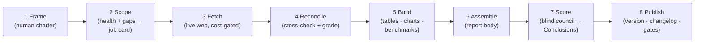

# How these reports are built

This repo is a working demonstration of **AI-run business analysis with human governance**: every report is produced by a documented, version-controlled pipeline in which AI agents do the labor, deterministic scripts do the arithmetic, and a human owns the questions and every approval gate. This page is the tour for a non-technical reader; every claim below is verifiable in the repo itself.

## Who does what

| Role | Who | What they own |
|---|---|---|
| **Author** | human | The charter (`pipeline/<slug>/HUMAN.md`): the thesis, the key questions, the style rules — plus every approval gate (frame changes, expensive data fetches, council roster, releases). |
| **Architect** | Claude (Anthropic) | The pipeline itself: scoping work, reviewing and merging every pull request, running the build/assemble/score/publish stages. |
| **Runner** | Perplexity | Cost-gated live-web data fetches, queued one at a time in [`PERPLEXITY.md`](PERPLEXITY.md); delivers by pull request, never merges. |
| **Council** | one frontier model per major AI lab | Blind scoring of the report's key questions — each member sees only the questions and the report body (never the existing Conclusions, never another member's answers). |

## The 8 stages

Every module in the pipeline belongs to exactly one stage, and the stage number leads its filename — open [`pipeline/sg-banks/method/`](pipeline/sg-banks/method/) and the folder reads in pipeline order:

1. **Frame** — the author writes the thesis and key questions in `HUMAN.md`. Human-owned: the AI proposes wording only when asked, and never edits without explicit approval.
2. **Scope** — scripts measure what the pipeline has and what's missing (`health`, `gaps`); the architect turns gaps into a queued job card. A queued card *is* the author's cost authorization.
3. **Fetch** — live-web retrieval of source data (bank filings, industry series) into plain CSV/markdown, with per-row provenance stamps. Expensive, therefore strictly opt-in.
4. **Reconcile** — fetched values are cross-checked (two retrievers where possible), tied out arithmetically, graded by source tier, and flagged where they disagree — disagreements are documented, never averaged away.
5. **Build** — deterministic scripts turn the reconciled data into every table, chart, and benchmark. No AI here: same input, same output, and CI re-runs every script on every pull request to prove the published numbers match the data.
6. **Assemble** — the AI assembles the report body from the built components; machine-synced regions (marked in the markdown) are injected by script so hand-transcription errors are structurally impossible.
7. **Score** — the blind council: one frontier model per major lab independently scores every key question (−5…+5 alignment with the thesis, plus how decisive the question is) and the thesis overall. A script aggregates the sheets into the report's Conclusions — the median is display-only; every member's row is preserved, and disagreement is shown deliberately. The council reads the report body only — the Conclusions are stripped from its packet, so no member ever sees the previous verdict or another member's answers.
8. **Publish** — one script does the release bookkeeping (version, changelog, score history) and re-runs every gate. Versions are `YYYY.MM.DD`; git tags and history make every prior release reproducible.

**Why this never loops:** the report is a *body* plus *generated overlay regions* (the benchmark tables, the Conclusions). The body is assembled before scoring; the council reads the body only; the scores flow back only into the overlay. Data flows one way.

## Provenance, all the way down

- **Every data cell** carries a retrieval stamp (`YYYYMMDD-NNN` + a harness/model code like `PxClOpus4.8`) telling you which AI, on which harness, fetched it and when.
- **Every commit** carries `Generated-by:` trailers naming the harness and model that actually did the work — the model that *actually ran, printed at run time*, never an assumed or configured name. (This rule has teeth: a council run through a model-router was rejected when every seat turned out to be the same model under different labels — see `PERPLEXITY.md`, Job #4.)
- **Every published number** is CI-verified: scripts regenerate all tables, charts, benchmarks, health metrics, and the Conclusions scorecard from the raw data on every pull request, and the merge is blocked if anything differs.

## Where to look

- The published report: [`reports/sg-banks.md`](reports/sg-banks.md)
- The author's charter: [`pipeline/sg-banks/HUMAN.md`](pipeline/sg-banks/HUMAN.md)
- The pipeline controller and module table: [`pipeline/sg-banks/UPDATE.md`](pipeline/sg-banks/UPDATE.md)
- The council protocol: [`pipeline/sg-banks/method/7-ai-write-scores.md`](pipeline/sg-banks/method/7-ai-write-scores.md)
- Pipeline health & data-confidence dashboard: [`pipeline/sg-banks/meta/health.md`](pipeline/sg-banks/meta/health.md)
- Decisions & release history: [`pipeline/sg-banks/index.md`](pipeline/sg-banks/index.md)
- Agent ground rules & commit attribution: [`AGENTS.md`](AGENTS.md)
