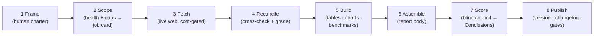

# HMHC Reports

The reports are published and read **directly in this repo** — GitHub's native markdown rendering is the primary view (use the outline menu at the top-right of any report for section navigation). A styled mirror lives at **[reports.hmhc.ai](https://reports.hmhc.ai)**.

Each report is a self-contained, source-graded business analysis produced with a disciplined, AI-assisted **modular pipeline**. Reports are **sticky** (a stable URL always shows the latest version) and **versioned** (full history in git commits, tags, and releases).

## Layout

```
reports/      The published reports — what a reader opens.
  <slug>.md         One file per report (e.g. sg-banks.md), always the latest
                    version; generated regions (tables, Conclusions) live
                    between markers inside it.
  index.json        Registry of all reports: title, status, dates, version,
                    current release note.
  assets/           Charts and images (<slug>-*.svg).

pipeline/     How each report is made. Not published.
  <slug>/
    index.md        Registry of decisions and history: standing decisions,
                    open questions, changelog.
    method/         One file per pipeline step, named <stage>-<actor>-<name> so
                    alphabetical order = pipeline order: 2-script-build-gaps.py,
                    3-ai-fetch-peers.md, … 8-script-publish.py. "ai" steps run
                    on AI models; "script" steps are deterministic programs
                    (each .py pairs with a same-stem .md spec).
    data/           Working data: ledger.csv (reconciliation master), peers.csv,
                    flows.csv, signals.md, generated tables/benchmarks, and
                    scores/ (the blind council answer sheets).
    meta/           Pipeline-about-itself: health.md/json (completeness &
                    confidence), gaps.md/json (worklist), history files.

CLAUDE.md         The Maintainer's operating manual + the controller for any
                  report change (module tables, ask-gate, cost-gate, publish).
HUMAN.md          Human-owned — everything the Author wrote, per report:
                  <slug> · Frame (thesis + key factors) and <slug> · Style.
AGENTS.md         Thin agent entry file (agents.md standard): binds any AI
                  agent to § Governance below + its role file.
PERPLEXITY.md     Job card for the external Contributor (currently Perplexity).
IDEAS.md          Author ↔ Maintainer improvement brainstorm — nothing in it
                  is authorized for implementation until explicitly approved.
```

## Architecture

Every report is produced by a documented, version-controlled pipeline in which AI agents do the labor, deterministic scripts do the arithmetic, and a human owns the questions and every approval gate. Eight fixed stages, with every module belonging to exactly one stage and the stage number leading its filename — open `pipeline/sg-banks/method/` and the folder reads in pipeline order:



- **Frame** (human) → **Scope** (what's missing → cost-gated job card) → **Fetch** (live web, expensive, opt-in) → **Reconcile** (cross-checked, tied out, source-graded; disagreements documented, never averaged away) → **Build** (deterministic scripts produce every table, chart, and benchmark — no AI; CI re-runs every script on every PR and blocks the merge if a published number drifts from the data) → **Assemble** (AI writes the report body; marked regions are script-injected so hand-transcription errors are structurally impossible) → **Score** (the blind council: one frontier model per major lab scores every key factor −5…+5 + criticality, judges 0–100 whether the factors suffice, and may suggest missing factors; every member's scores are published side by side, no medians) → **Publish** (one script: version, changelog, score history, all gates).
- **Why this never loops:** the report is a *body* plus *generated overlay regions* (benchmark tables, Conclusions, the machine-oriented Appendix E). The body is assembled before scoring; the council reads the body only (Conclusions stripped from its packet); scores flow back only into the overlay. Data flows one way.
- **Provenance all the way down:** every data cell carries a retrieval stamp (`YYYYMMDD-NNN` + harness/model code); every commit carries `Generated-by:` trailers naming the model that **actually ran, printed at run time** — never an assumed or configured name (this rule has teeth: a council run through a model-router was rejected when every seat turned out to be the same model under different labels — see `PERPLEXITY.md`, Job #4).

The per-report module tables — method files, outputs, costs, dependencies, and the cost gates — live in **`CLAUDE.md`**, the controller every change must route through. Do not duplicate them here.

## Governance

Four roles, standard vocabulary, each bound by its own file:

| Role | Who | Type | Owns |
|---|---|---|---|
| **Author** | the human | human | `HUMAN.md` (thesis, key factors, style per report) and every approval gate: frame changes, expensive fetches, council roster, releases. Nothing human-owned is ever edited without the Author's explicit approval. |
| **Maintainer** | Claude (Anthropic) | AI agent | The pipeline: scopes jobs, reviews and merges every pull request, runs the build/assemble/score/publish stages. Bound by `CLAUDE.md`. |
| **Contributor** | Perplexity (currently) | AI agent | Cost-gated data-fetch jobs queued in `PERPLEXITY.md`; writes only the declared deliverable, always by pull request, never merges. |
| **Council** | one frontier model per major AI lab | AI agents | Blind scoring of each report's key factors — each member sees only its sealed packet (Frame + report body, Conclusions stripped), never another member's answers, and never edits the repo. |

Golden rules (bind every agent):
1. **Never edit anything under `reports/` directly** — published content is generated, not hand-edited; every change routes through the controller in `CLAUDE.md`.
2. **Expensive fetch modules are opt-in only**, behind the controller's explicit ask-gate and cost gate; staleness only flags them, never runs them.
3. **`HUMAN.md` is human-owned** — agents may propose changes on request but never silently regenerate it.
4. **Versioning is git-native** — sticky `reports/<slug>.md`, history via commits and auto-created tags `<slug>-v<version>`; never rename a published slug.
5. **GitHub is the primary view** — reports are read as rendered markdown in this repo; a styled mirror lives on Replit at `reports.hmhc.ai`, maintained outside this repo.
6. **Model identity is what actually ran** — commits, data stamps, and council sheets record the model that ran, printed at run time; multi-model routers that relabel models are inadmissible for council seats.

## Reports

| Series | Slug | Status |
|---|---|---|
| Analysis of Singapore Banks (DBS · OCBC · UOB) | `sg-banks` | Published |

## Adding a new report

1. Create `reports/<slug>.md` (the report) and put its charts in `reports/assets/` as `<slug>-*.svg`.
2. Create `pipeline/<slug>/` with `index.md`, `method/` (the stage-numbered module SOPs), and `data/`; add the report's Frame + Style sections to root `HUMAN.md` and its module table to `CLAUDE.md`.
3. Add the report's entry to `reports/index.json`.
4. Commit and merge; the tag `<slug>-v<version>` is auto-created on `main` by the tag-version workflow.

## Versioning

`report.md` is overwritten in place, so its URL never changes. History lives in git: `git log`, `git blame`, tags, and GitHub Releases for public, dated milestones. Versions are `YYYY.MM.DD` of the publish date; a same-day re-release appends `-r2`, `-r3`, … (e.g. `sg-banks-v2026.07.20-r2`).

## Conventions

Slugs and filenames are lowercase-hyphenated and permanent — never rename a published slug, it breaks links and bookmarks. Files are named for what they contain, not their format. Figures stay in the report's stated currency; sources are Tier-1 filings; no estimates or memory-fills. AI agents start at `AGENTS.md`; every AI commit carries the attribution trailers defined there.
