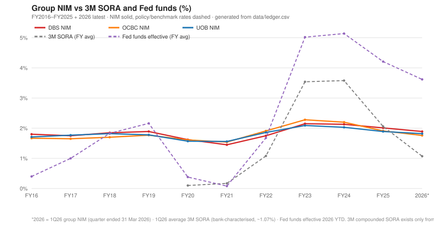

# Analysis of Singapore Banks — DBS · OCBC · UOB

## Purpose

**Thesis.** The Singapore banks — DBS, OCBC and UOB, as a group or individually — are a value buy-and-hold for the next 10–15 years.

**Key factors this analysis scores** *(each is scored by the blind council in the Conclusions below — performance vs the thesis and criticality — and analyzed in full in Supporting Data)*:

**A. Capital attraction — the primary factor**

1. **Client-asset growth** — CA = customer deposits + wealth AUM
2. **Wealth-hub capital flows** — Singapore vs the global cross-border pool

**B. Monetization — secondary (expected to follow attraction)**

3. **Income engines: NII & Other Revenue**
4. **NIM cyclicality & rate sensitivity**
5. **Client-asset monetization vs peers** — headroom vs mean-reversion

**C. Valuation**

6. **Valuation premium vs peers & required outperformance**

**Scope.** DBS (SGX: D05) · OCBC (O39) · UOB (U11) · FY2016–FY2025 (31-Dec year-ends) + 1Q2026 interim (quarters ended 31 Mar 2026) + current (2026-07-20 intraday) valuation · **every series in its reporting currency, never FX-converted — SG-bank series in SGD** · notation and formats in Appendix D.

> **This is not financial advice.** It is a demonstration of the use of AI in business analysis.

---

## Key links

This report is produced by a documented, AI-run workflow with human governance, fully version-controlled in a public GitHub repository — the repo itself is the demonstration:

- [**The repository**](https://github.com/hmhc-ai/hmhc-reports) — every instruction file, data file, and revision, in the open
- [**How it's built**](https://github.com/hmhc-ai/hmhc-reports/blob/main/README.md#architecture) — the agents, the 8-stage pipeline, and the provenance discipline, for non-technical readers
- [**The author's charter**](https://github.com/hmhc-ai/hmhc-reports/blob/main/HUMAN.md) — the human-owned thesis, key questions, and style rules this report must answer to
- [**The council protocol**](https://github.com/hmhc-ai/hmhc-reports/blob/main/pipeline/sg-banks/method/7-ai-write-scores.md) — how the blind multi-model council scores the questions in the Conclusions below
- [**Pipeline health**](https://github.com/hmhc-ai/hmhc-reports/blob/main/pipeline/sg-banks/meta/health.md) — live completeness & data-confidence dashboard (CI-verified)
- [**Decisions & release history**](https://github.com/hmhc-ai/hmhc-reports/blob/main/pipeline/sg-banks/index.md) — standing analytical decisions and the full changelog

---

<!-- conclusions:start -->
## Conclusions — Council Scorecard

Council of 2 — scores shown **per member**, in column order: `CwClFable5` · `GkGrok4`. Each member scored **blind** (frame + report body only, prior Conclusions removed; protocol `method/7-ai-write-scores.md`). Performance = alignment with the thesis, −5…+5 · criticality = how decisive the factor is for the thesis · factor coverage = whether these factors suffice to judge the thesis, 0–100 (low = the frame is missing material factors). No averaging: disagreement is shown deliberately — it is a signal.

| Factor | Topic | Performance | Criticality |
|---|---|---|---|
| Q1 | Client-asset growth | +4 · +4 | critical · critical |
| Q2 | Wealth-hub capital flows | +4 · +5 | high · critical |
| Q3 | Income engines: NII & Other Revenue | +2 · +2 | medium · high |
| Q4 | NIM cyclicality & rate sensitivity | 0 · +1 | medium · medium |
| Q5 | Client-asset monetization vs peers | -1 · +3 | high · high |
| Q6 | Valuation premium vs peers | -2 · -1 | high · high |
| — | **Thesis overall** | **+2 · +2** | — |
| — | **Factor coverage** (0–100) | 75 · 72 | — |

### CwClFable5 — Claude Code (Claude Fable 5 (claude-fable-5)) · 2026-07-29 · scored v2026.07.29-r2

- **Q1** · +4 · critical — Deposits, wealth AUM and client assets compound mid-single-digit-plus at all three banks with FY24-25 growth above the 5-year trend at DBS and OCBC - the primary driver is intact and accelerating.
- **Q2** · +4 · high — Singapore's cross-border wealth grew 11.8%/yr over 2020-25, fastest of the big three hubs, lifting its share of the global offshore pool from 12.9% to 13.4% - the external attraction test passes, with Hong Kong still larger in absolute terms.
- **Q3** · +2 · medium — Both income engines compounded high-single-digit over five years, but the yearly columns show NII carried by the FY22-23 rate surge and Other Revenue only partially offsetting its FY25 stall at UOB.
- **Q4** · 0 · medium — NIM is highly cyclical (53-74bps trough-to-peak, now compressing as SORA falls), which neither supports nor refutes the thesis but shows NII alone cannot anchor income - the deposit franchise damping is the redeeming feature.
- **Q5** · -1 · high — The SG banks out-earn HSBC on NII per deposit (110-122) but lag badly on non-NII monetization (OR_vDep 56-73 vs US peers 140-181), so the monetization half of the thesis is not yet demonstrated - though closing that gap to parity is worth +13-26% of revenue, which is the upside case.
- **Q6** · -2 · high — DBS and OCBC trade at 157-175 on P/CA and P/Rev versus HSBC = 100, requiring +9-12% annual outperformance for five years - much of the attraction story is already in the price, with UOB the near-parity exception.
- **Thesis** · +2 — Capital attraction is verified internally and externally and monetization is adequate but not yet superior, so the thesis's driver holds while the entry price already assumes the non-NII acceleration the income data does not yet show.
- **Factor coverage** · 75/100 — The six factors cover attraction, monetization and price well, but nothing scores the durability of the income engine (credit quality, capital headroom) or where the next decade of growth comes from - enough to form an opinion, not enough to hold it with confidence.

### GkGrok4 — Grok app (lab-native session) (Grok 4) · 2026-07-29 · scored v2026.07.29-r2

- **Q1** · +4 · critical — Client assets compounded at 6.4–8.5 % over five years with wealth AUM CAGRs of 7–13 % and accelerating recent growth, especially at DBS, confirming sustained capital attraction.
- **Q2** · +5 · critical — Singapore’s cross-border wealth stock rose at an 11.8 % five-year CAGR to US$2.1 tn, outpacing Hong Kong and Switzerland and lifting its global share to 13.4 %, establishing a clear structural inflow advantage.
- **Q3** · +2 · high — Five-year CAGRs of roughly 9 % for NII and 5–9 % for other revenue demonstrate durable income engines, although FY25 NII declined with the rate cycle while fee income remained more resilient.
- **Q4** · +1 · medium — NIM amplitude of only 50–70 bps across a multi-year rate cycle is far smaller than the corresponding policy-rate swings, illustrating the dampening effect of the sticky deposit franchise.
- **Q5** · +3 · high — NII-to-deposit ratios sit above the HSBC benchmark while other-revenue ratios lag, leaving quantified uplift potential of 13–26 % of revenue at parity that the thesis correctly frames as optionality on an already-attracted base.
- **Q6** · -1 · high — DBS and OCBC trade at material premiums on P/CA and P/Rev that would require high single- to double-digit annual outperformance for five-year convergence, while UOB sits nearer parity; the group is therefore not uniformly a deep-value proposition at current prices.
- **Thesis** · +2 — Primary capital-attraction factors (client-asset growth and Singapore’s rising share of global offshore wealth) supply a durable long-term compounding base that outweighs secondary cyclical NIM pressure and the elevated valuations of DBS and OCBC.
- **Factor coverage** · 72/100 — The six factors capture the core attraction-monetization-valuation chain that underpins the long-term thesis, yet leave material gaps on credit-risk trajectory, capital-return sustainability, and intra-group competitive positioning that can independently determine outcomes over a 10–15-year horizon.

### Council-suggested factors (not yet in the frame; adoption is the author's decision)

- **NII quality & capital headroom** (`CwClFable5`) — The report scores NII levels and cyclicality but not durability - CET1 headroom, loan-book mix and credit costs determine whether the income engine can safely expand with the client-asset base.
- **Growth by geography & product** (`CwClFable5`) — Factor 6 shows the price demands +9-12%/yr outperformance, yet no factor tracks where incremental growth would come from - regional expansion and entry into adjacent revenue pools are unmeasured.
- **Asset quality & credit-cost trajectory** (`GkGrok4`) — NPL ratios remain low (0.9–1.5 %) and credit costs contained, yet UOB’s elevated 1Q26 figure and Greater-China NPA rise introduce a material risk variable not captured in the existing frame.
- **Capital-return and dividend sustainability** (`GkGrok4`) — CET1 ratios of 15–17 % and historical payout capacity form a key component of total shareholder return for a 10–15-year buy-and-hold thesis, yet are absent from the scored factors.
- **Intra-group competitive dynamics** (`GkGrok4`) — Relative AUM growth, fee momentum and valuation spreads among DBS, OCBC and UOB themselves affect whether the group or any single name is the preferred vehicle, information already present in the tables but not scored as a distinct factor.

*The council scores the frame's key factors; the full frame-format analysis is in Supporting Data below. Assembled deterministically by `method/7-script-build-conclusions.py`. Not investment advice.*
<!-- conclusions:end -->

---

## Supporting Data

*The frame's key factors analyzed in full, in their specified formats — objective data only; judgements live in the Conclusions scorecard above.*

### Analysis by factor

**A. Capital attraction — Factor 1: Client-asset growth**

| Bank_Metric | S$bn | CASA % | 5y-CAGR | FY25 % | FY24 % | FY23 % | FY22 % |
|---|---:|---:|---:|---:|---:|---:|---:|
| DBS_Deposits | 610 | 54.5 | 5.6% | +8.6 | +5.0 | +1.5 | +5.0 |
| DBS_WealthAUM | 488 |  | 13.1% | +14.6 | +16.7 | +22.9 | +2.1 |
| DBS_ClientAssets | 1,098 |  | 8.5% | +11.2 | +9.7 | +9.2 | +3.9 |
| OCBC_Deposits | 428 | 50.7 | 6.3% | +9.6 | +7.4 | +3.9 | +2.2 |
| OCBC_WealthAUM | 343 |  | 7.3% | +14.7 | +13.7 | +1.9 | +0.0 |
| OCBC_ClientAssets | 771 |  | 6.8% | +11.8 | +10.0 | +3.1 | +1.3 |
| UOB_Deposits | 426 | 58.4 | 5.6% | +5.4 | +4.9 | +4.5 | +4.5 |
| UOB_WealthAUM | 201 |  | 8.4% | +5.8 | +8.0 | +14.3 | +10.8 |
| UOB_ClientAssets | 627 |  | 6.4% | +5.6 | +5.9 | +7.4 | +6.3 |

*Levels and CASA % as of FY25. 5y-CAGR = FY2020→FY2025; each FYxx % = that FY's YoY growth. **Client Assets = customer deposits + wealth AUM** (renamed from "Capital Base" to avoid collision with regulatory total capital) — included to test how consistent the AUM/deposit/client-asset definitions are: AUM definitions differ per bank (DBS "Wealth Management AUM"; OCBC group wealth incl. Bank of Singapore + Great Eastern; UOB narrower, reclassified 1-Jan-2023), so client-asset *levels* are not cross-comparable — read within-bank trends. Secondary (1Q26): DBS deposits reached S$630bn with a record S$492bn AUM (+17% YoY cc, +S$10bn net new money); UOB added +S$1bn net new money. Sources: Tables 1–2; 1Q2026 attraction table; Signals — DBS 2026-04-30, UOB 2026-05-07.*

**A. Capital attraction — Factor 2: Wealth-hub capital flows** — analyzed in the flows block of Table 6 below (cross-border stock per hub, the *Global — all centres* share denominator, and the market-sizing key stats).

**B. Monetization — Factor 3: Income engines, NII & Other Revenue**

| Bank_Metric | S$bn | 5y-CAGR | FY25 % | FY24 % | FY23 % | FY22 % |
|---|---:|---:|---:|---:|---:|---:|
| DBS_NII | 14.5 | 9.8% | +0.5 | +5.7 | +24.7 | +29.6 |
| DBS_OR | 8.4 | 8.8% | +6.7 | +20.4 | +17.6 | −5.1 |
| OCBC_NII | 9.2 | 8.9% | −6.2 | +1.1 | +25.5 | +31.3 |
| OCBC_OR | 5.5 | 5.5% | +15.8 | +22.2 | +7.3 | −24.1 |
| UOB_NII | 9.4 | 9.2% | −3.3 | −0.1 | +16.0 | +30.6 |
| UOB_OR | 4.5 | 7.2% | −3.6 | +8.6 | +31.6 | −5.0 |

*Levels as of FY25. OR = total income − NII (derived from reported figures). 5y-CAGR = FY2020→FY2025; each FYxx % = that FY's YoY growth. OCBC FY22 OR reflects the SFRS(I) 17 insurance restatement. Sources: Tables 1 ×3; Appendix C.*

**B. Monetization — Factor 4: NIM cyclicality & rate sensitivity**



*Chart generated deterministically from `data/ledger.csv` by `method/5-script-build-charts.py` (CI-verified). Intra-cycle swing ≈ 53–74bps trough-to-peak — large enough that NII alone cannot anchor income, which is why the fee/wealth offset (Q3) matters. NIM's amplitude is far smaller than the policy rates' (~5pp Fed swing → ~0.7pp NIM swing): deposit franchises damp the cycle. Sources: Table 5; 1Q2026 income table.*

**B. Monetization — Factor 5: Client-asset monetization vs peers** — analyzed in the monetization block of Table 6 below (NII/OR levels, the four HSBC = 100 indices, as-stated NIM context, and the implied OR-uplift line).

**C. Valuation — Factor 6: Valuation premium vs peers & required outperformance** — analyzed in the valuation block of Table 6 below (four indexes vs HSBC = 100 with dated local prices and req %/yr).

---

*Reference tables below — the 1Q2026 interim set and Tables 1–6.*

<!-- FUTURE WORKFLOW (TBD): per-table notes for latest-quarter actuals & executive forecasts will be added here. Not built yet. -->

### 1Q2026 interim (quarter ended 31 Mar 2026)

#### 1Q2026 — income & returns (S$m unless %)

| Metric (1Q26) | DBS | OCBC | UOB | Note |
|---|---:|---:|---:|---|
| Net interest income | 3,494 | 2,222 | 2,324 | all down ~4–5% YoY; UOB Tier-2 host |
| Non-interest income | 2,454 | 1,606 | 1,098 | derived (TI−NII); UOB slide components don't reconcile (see notes) |
| Total income | 5,948 | 3,828 | 3,422 | records at DBS & OCBC |
| Net fee income | 1,482 | 675 | 637 | DBS +16% · OCBC +24% · UOB −8% YoY |
| Net profit | 2,930 | 1,974 | 1,437 | +1% / +5% / −4% YoY |
| Group NIM (%) | 1.89 | 1.76 | 1.82 | all down YoY; OCBC steepest (−28bps) |
| ROE (%) | 17.0 | 13.0 | 11.5 | reported (group) |
| Cost/income (%) | 38.7 | 39.3 | 44.5 | |

*NII + Non-II = Total income ties exactly for all three (DBS 3,494+2,454=5,948 · OCBC 2,222+1,606=3,828 · UOB 2,324+1,098=3,422). DBS non-II derived (fee 1,482 + other 972); OCBC NII derived-to-tie (press release prints NII ≈ "S$2.22bn"). **UOB non-II caveat:** UOB's CFO-slide component split (net fee 637 + trading & investment 405 + other 462 = 1,504) does **not** reconcile with total income − NII (1,098); the tie-out-consistent derived 1,098 is used and the slide split is flagged as an unresolved retrieval gap. Sources: [DBS 1Q26 Trading Update](https://www.dbs.com/iwov-resources/images/investors/quarterly-financials/2026/1Q26_trading_update.pdf); [OCBC 1Q26 Press Release](https://www.ocbc.com/group/media/release/2026/ocbc-group-first-quarter-2026-net-profit-up-5percent.page); [OCBC 1Q26 Results (SGX PDF)](https://links.sgx.com/FileOpen/OCBC_1Q26_Results_Press_Release.ashx?App=Announcement&FileID=888006); [UOB 1Q26 CFO Slides (via MarketScreener)](https://www.marketscreener.com/news/united-overseas-bank-uob-group-1q26-trading-update-cfo-slides-ce7f58d2d18df127); [UOB Financial Highlights](https://www.uobgroup.com/investor-relations/financial/financial-highlights.html).*

#### 1Q2026 — attraction, balance sheet & asset quality (period-end 31 Mar 2026)

| Metric | DBS | OCBC | UOB | Note |
|---|---:|---:|---:|---|
| Customer deposits (S$m) | 629,868 | 444,000 | 427,000 | |
| CASA ratio (%) | 55.0 | 50.2 | 57.0 | printed / mix basis differs |
| Wealth AUM (S$m) | 492,000 | 342,000 | 198,000 | **definitions differ — do not compare levels** |
| Total assets (S$m) | 935,365 | 703,124 | 574,000 | leverage only, not attraction |
| Gross loans (S$m) | 453,180 | 347,000 | 354,000 | |
| CET1 ratio (%) | 16.9 | 17.0 | 15.3 | |
| NPL ratio (%) | 1.0 | 0.9 | 1.5 | |
| Credit cost (bps) | 14 | 23 | 26 | OCBC incl. S$191m overlay; UOB elevated |

***Never sum deposits + AUM** (double-count). Wealth-AUM levels are **not** cross-comparable — DBS "Wealth Management AUM"; OCBC group wealth incl. Bank of Singapore + Great Eastern; UOB "Group Retail AUM" (narrower, reclassified 1-Jan-2023). DBS record wealth AUM S$492bn (+17% YoY cc), net new money +S$10bn ([DBS 1Q26 CFO presentation](https://www.dbs.com/iwov-resources/images/investors/quarterly-financials/2026/1Q26_CFO_presentation.pdf)). OCBC credit cost includes S$191m management-overlay allowances for non-impaired assets ([OCBC 1Q26 Press Release](https://www.ocbc.com/group/media/release/2026/ocbc-group-first-quarter-2026-net-profit-up-5percent.page)). UOB credit cost 26bps with Greater-China NPAs rising ([Bloomberg, 6 May 2026](https://www.bloomberg.com/news/articles/2026-05-06/uob-profit-dips-on-lending-income-ceo-says-uncertainty-elevated)). UOB balance-sheet/ratio lines are Tier-1 ([UOB Financial Highlights](https://www.uobgroup.com/investor-relations/financial/financial-highlights.html)); UOB CASA / wealth AUM / credit cost are Tier-2 host ([UOB 1Q26 CFO Slides](https://www.marketscreener.com/news/united-overseas-bank-uob-group-1q26-trading-update-cfo-slides-ce7f58d2d18df127)).*

#### 1Q2026 — current valuation (as of 2026-07-20, intraday)

| Metric | DBS | OCBC | UOB |
|---|---:|---:|---:|
| Price (S$, intraday 2026-07-20) | 71.96 | 28.60 | 42.60 |
| FY2025 BVPS (S$) | 24.29 | 13.38 | 29.36 |
| Current P/B | 2.96 | 2.14 | 1.45 |
| Current vs 10-yr avg P/B | +96% | +84% | +24% |
| FY2025 TBVPS (S$) | 22.07 | 12.41 | 26.36 |
| Current P/TB | 3.26 | 2.30 | 1.62 |

*Prices are **intraday 2026-07-20 (Perplexity Finance, SGX open) — NOT closing prices**; treat as a tier-2 market-data snapshot only. P/B = price ÷ FY2025 BVPS; P/TB = price ÷ FY2025 TBVPS (FY2025 per-share book denominators; 1Q26 per-share book not retrieved). All three continue to trade well above their own 10-yr average P/B (1.51 / 1.16 / 1.17), richest at DBS. These figures update the Table 4 "Current P/B" rows and the P/TB "current" column below.*

---

### Table 1 — DBS: Income Engine

| FY | Dep | Assets | NII | Other | TotalRev | Profit | NIM | Rev/Dep | Profit/Dep | Profit/Rev |
|---|---:|---:|---:|---:|---:|---:|---:|---:|---:|---:|
| 2016 | 347 | 482 | 7.3 | 4.2 | 11.5 | 4.2 | 1.80% | 0.033 | 0.012 | 0.37 |
| 2017 | 374 | 518 | 7.8 | 4.1 | 11.9 | 4.4 | 1.75% | 0.032 | 0.012 | 0.37 |
| 2018 | 394 | 551 | 9.0 | 4.2 | 13.2 | 5.6 | 1.85% | 0.033 | 0.014 | 0.43 |
| 2019 | 404 | 579 | 9.6 | 4.9 | 14.5 | 6.4 | 1.89% | 0.036 | 0.016 | 0.44 |
| 2020 | 465 | 650 | 9.1 | 5.5 | 14.6 | 4.7 | 1.62% | 0.031 | 0.010 | 0.32 |
| 2021 | 502 | 686 | 8.4 | 5.9 | 14.3 | 6.8 | 1.45% | 0.028 | 0.014 | 0.48 |
| 2022 | 527 | 743 | 10.9 | 5.6 | 16.5 | 8.2 | 1.75% | 0.031 | 0.016 | 0.50 |
| 2023 | 535 | 739 | 13.6 | 6.5 | 20.2 | 10.3 | 2.15% | 0.038 | 0.019 | 0.51 |
| 2024 | 562 | 827 | 14.4 | 7.9 | 22.3 | 11.4 | 2.13% | 0.040 | 0.020 | 0.51 |
| 2025 | 610 | 897 | 14.5 | 8.4 | 22.9 | 11.0 | 2.01% | 0.038 | 0.018 | 0.48 |
| **CAGR 21→25** | 5.0% | 6.9% | 14.5% | 9.4% | 12.5% | 12.9% |  |  |  |  |
| **CAGR 16→25** | 6.5% | 7.2% | 7.9% | 8.1% | 8.0% | 11.2% |  |  |  |  |

*Other = TotalRev − NII (derived). TotalRev = reported total income. Rev/Dep = TotalRev ÷ Deposits; Profit/Dep = Profit ÷ Deposits; Profit/Rev = Profit ÷ TotalRev (all dimensionless). CAGR = (end/start)^(1/n) − 1, on FY2021→FY2025 (4-yr) and FY2016→FY2025 (9-yr) bases. NIM = group net interest margin as reported. Profit = net profit attributable to shareholders (reported).*

### Table 1 — OCBC: Income Engine

| FY | Dep | Assets | NII | Other | TotalRev | Profit | NIM | Rev/Dep | Profit/Dep | Profit/Rev |
|---|---:|---:|---:|---:|---:|---:|---:|---:|---:|---:|
| 2016 | 261 | 410 | 5.1 | 3.4 | 8.5 | 3.5 | 1.67% | 0.032 | 0.013 | 0.41 |
| 2017 | 284 | 453 | 5.4 | 4.2 | 9.6 | 4.1 | 1.65% | 0.034 | 0.015 | 0.43 |
| 2018 | 295 | 468 | 5.9 | 3.8 | 9.7 | 4.5 | 1.70% | 0.033 | 0.015 | 0.46 |
| 2019 | 303 | 492 | 6.3 | 4.5 | 10.9 | 4.9 | 1.77% | 0.036 | 0.016 | 0.45 |
| 2020 | 315 | 521 | 6.0 | 4.2 | 10.1 | 3.6 | 1.61% | 0.032 | 0.011 | 0.35 |
| 2021 | 342 | 542 | 5.9 | 4.7 | 10.6 | 4.9 | 1.54% | 0.031 | 0.014 | 0.46 |
| 2022 | 350 | 557 | 7.7 | 3.6 | 11.3 | 5.5 [6] | 1.91% | 0.032 | 0.016 | 0.49 |
| 2023 | 364 | 581 | 9.6 | 3.9 | 13.5 | 7.0 | 2.28% | 0.037 | 0.019 | 0.52 |
| 2024 | 391 | 625 | 9.8 | 4.7 | 14.5 | 7.6 | 2.20% | 0.037 | 0.019 | 0.52 |
| 2025 | 428 | 676 | 9.2 | 5.5 | 14.6 | 7.4 | 1.91% | 0.034 | 0.017 | 0.51 |
| **CAGR 21→25** | 5.8% | 5.7% | 11.8% | 3.6% | 8.4% | 11.2% |  |  |  |  |
| **CAGR 16→25** | 5.6% | 5.7% | 6.8% | 5.3% | 6.2% | 8.8% |  |  |  |  |

*Other = TotalRev − NII (derived). TotalRev = reported total income. Rev/Dep = TotalRev ÷ Deposits; Profit/Dep = Profit ÷ Deposits; Profit/Rev = Profit ÷ TotalRev (all dimensionless). CAGR = (end/start)^(1/n) − 1, on FY2021→FY2025 (4-yr) and FY2016→FY2025 (9-yr) bases. NIM = group net interest margin as reported. Profit = net profit attributable to shareholders (reported). [6] FY2022 figures as restated for SFRS(I) 17 (insurance) in the FY2023 release.*

### Table 1 — UOB: Income Engine

| FY | Dep | Assets | NII | Other | TotalRev | Profit | NIM | Rev/Dep | Profit/Dep | Profit/Rev |
|---|---:|---:|---:|---:|---:|---:|---:|---:|---:|---:|
| 2016 | 255 | 340 | 5.0 | 3.1 | 8.1 | 3.1 | 1.71% | 0.032 | 0.012 | 0.38 |
| 2017 | 273 | 359 | 5.5 | 3.3 | 8.9 | 3.4 | 1.77% | 0.032 | 0.012 | 0.38 |
| 2018 | 293 | 388 | 6.2 | 2.9 | 9.1 | 4.0 | 1.82% | 0.031 | 0.014 | 0.44 |
| 2019 | 311 | 387 | 6.6 | 3.5 | 10.0 | 4.3 | 1.78% | 0.032 | 0.014 | 0.43 |
| 2020 | 325 | 424 | 6.0 | 3.1 | 9.2 | 2.9 | 1.57% | 0.028 | 0.009 | 0.32 |
| 2021 | 353 | 459 | 6.4 | 3.4 | 9.8 | 4.1 | 1.56% | 0.028 | 0.012 | 0.42 |
| 2022 | 369 | 504 | 8.3 | 3.2 | 11.6 | 4.6 | 1.86% | 0.031 | 0.012 | 0.40 |
| 2023 | 385 | 524 | 9.7 | 4.3 | 13.9 | 5.7 | 2.09% | 0.036 | 0.015 | 0.41 |
| 2024 | 404 | 538 | 9.7 | 4.6 | 14.3 | 6.0 | 2.03% | 0.035 | 0.015 | 0.42 |
| 2025 | 426 | 572 | 9.4 | 4.5 | 13.8 | 4.7 [5] | 1.89% | 0.032 | 0.011 | 0.34 |
| **CAGR 21→25** | 4.8% | 5.6% | 10.0% | 7.0% | 9.0% | 3.5% |  |  |  |  |
| **CAGR 16→25** | 5.9% | 5.9% | 7.2% | 4.2% | 6.2% | 4.7% |  |  |  |  |

*Other = TotalRev − NII (derived). TotalRev = reported total income. Rev/Dep = TotalRev ÷ Deposits; Profit/Dep = Profit ÷ Deposits; Profit/Rev = Profit ÷ TotalRev (all dimensionless). CAGR = (end/start)^(1/n) − 1, on FY2021→FY2025 (4-yr) and FY2016→FY2025 (9-yr) bases. NIM = group net interest margin as reported. Profit = net profit attributable to shareholders (reported). [5] FY2025 profit −23% is a provisioning artefact: ~S$2.0bn pre-emptive general allowances booked 3Q2025; operating profit was −4%; UOB core net profit ≈ S$4.82bn (FY2022) / S$6.06bn (FY2023) where separately disclosed.*

---

### Table 2 — Attracted assets: deposits, CASA & wealth AUM

| FY | DBS Dep | DBS CASA | DBS AUM | OCBC Dep | OCBC CASA | OCBC AUM | UOB Dep | UOB CASA | UOB AUM |
|---|---:|---:|---:|---:|---:|---:|---:|---:|---:|
| 2016 | 347 | 61.8% | 166 | 261 | 51.1% [c1] | n/d | 255 | 44.5% | 93 |
| 2017 | 374 | 62.3% | 206 | 284 | 49.2% [c1] | n/d | 273 | 45.5% | 104 |
| 2018 | 394 | 58.6% | 220 | 295 | 46.4% [c1] | 258 | 293 | 44.5% | n/d |
| 2019 | 404 | 59.0% | 246 | 303 | 48.4% | 265 | 311 | 45.4% | n/d |
| 2020 | 465 | 72.7% | 264 | 315 | 60.3% | 241 | 325 | 53.5% | 134 |
| 2021 | 502 | 76.0% | 291 | 342 | 63.3% | 258 | 353 | 56.2% | 139 |
| 2022 | 527 | 60.3% | 297 | 350 | 51.8% | 258 | 369 | 47.5% | 154 |
| 2023 | 535 | 53.4% | 365 | 364 | 48.7% | 263 | 385 | 48.9% [u1] | 176 |
| 2024 | 562 | 51.8% | 426 | 391 | 48.8% | 299 | 404 | 54.7% [u1] | 190 |
| 2025 | 610 | 54.5% | 488 | 428 | 50.7% | 343 | 426 | 58.4% [u1] | 201 |
| **CAGR 21→25** | 5.0% |  | 13.8% | 5.8% |  | 7.4% | 4.8% |  | 9.7% |
| **CAGR 16→25** | 6.5% |  | 12.7% | 5.6% |  | n/r | 5.9% |  | 8.9% |

*Deposits = total non-bank customer deposits (group). CASA = (current + savings) / total customer deposits, as printed by each bank where available. Wealth AUM = bank-reported wealth / private-bank AUM. [c1] OCBC 2016–2018 CASA sourced from OCBC FY-results presentations (Tier-1) via a non-Claude retrieval pass (2026-07-16), computer-verified against source PDFs; currently `single-px` pending a second retriever. [u1] UOB CASA lifted ~48% → 58% (2023→25) mainly on post-rate-cycle deposit remix (customers rotating back from fixed deposits) plus mix contribution from the Citi consumer (deposit-heavy) book. CASA is a point-in-time ratio — CAGR cells intentionally blank. AUM: OCBC 2016–17 and UOB 2018–19 = `n/d` (not disclosed in that vintage of results decks). AUM definitions differ across banks (DBS "Wealth Management AUM"; OCBC group/banking wealth incl. Bank of Singapore + Great Eastern; UOB narrower, reclassified 1 Jan 2023) — read within-bank trends, not cross-bank levels. Never sum Deposits + AUM (double-count risk).*

---

### Table 3 — Net interest margin (Group) & NII

| FY | DBS NII | DBS NIM | OCBC NII | OCBC NIM | UOB NII | UOB NIM |
|---|---:|---:|---:|---:|---:|---:|
| 2016 | 7.30 | 1.80% | 5.05 | 1.67% | 4.99 | 1.71% |
| 2017 | 7.79 | 1.75% | 5.42 | 1.65% | 5.53 | 1.77% |
| 2018 | 8.96 | 1.85% | 5.89 | 1.70% | 6.22 | 1.82% |
| 2019 | 9.62 | 1.89% | 6.33 | 1.77% | 6.56 | 1.78% |
| 2020 | 9.08 | 1.62% | 5.97 | 1.61% | 6.04 | 1.57% |
| 2021 | 8.44 | 1.45% | 5.86 | 1.54% | 6.39 | 1.56% |
| 2022 | 10.94 | 1.75% | 7.69 | 1.91% | 8.34 | 1.86% |
| 2023 | 13.64 | 2.15% | 9.64 | 2.28% | 9.68 | 2.09% |
| 2024 | 14.42 | 2.13% | 9.76 | 2.20% | 9.67 | 2.03% |
| 2025 | 14.50 | 2.01% | 9.15 | 1.91% | 9.36 | 1.89% |

*NIM = group net interest margin, %, as printed by each bank; NII in S$bn (2 dp). DBS uses **group** NIM (not the commercial-book series, which was 2.80% in FY2024); canary FY2025 group NIM = 2.01%.*

---

### Table 4 — Valuation & Returns (P/B + ROE)

| FY | DBS Price | DBS BVPS | DBS P/B | DBS ROE | DBS RoTE | OCBC Price | OCBC BVPS | OCBC P/B | OCBC ROE | OCBC RoTE | UOB Price | UOB BVPS | UOB P/B | UOB ROE | UOB RoTE |
|---|---:|---:|---:|---:|---:|---:|---:|---:|---:|---:|---:|---:|---:|---:|---:|
| 2016 | 17.34 | 16.87 | 1.03 | 10.1 | n/d | 8.92 | 8.49 | 1.05 | 10.0 | n/d | 20.40 | 18.82 | 1.08 | 10.2 | n/d |
| 2017 | 24.85 | 17.85 | 1.39 | 9.7 | n/d | 12.39 | 8.96 | 1.38 | 11.2 | n/d | 26.45 | 20.37 | 1.30 | 10.2 | n/d |
| 2018 | 23.69 | 18.12 | 1.31 | 12.1 | n/d | 11.26 | 9.56 | 1.18 | 11.5 | n/d | 24.57 | 21.31 | 1.15 | 11.3 | n/d |
| 2019 | 25.88 | 19.17 | 1.35 | 13.2 | n/d | 10.98 | 10.38 | 1.06 | 11.4 | n/d | 26.41 | 22.33 | 1.18 | 11.6 | n/d |
| 2020 | 25.04 | 20.08 | 1.25 | 9.1 | n/d | 10.21 | 10.82 | 0.94 | 7.6 | n/d | 22.75 | 23.03 | 0.99 | 7.4 | n/d |
| 2021 | 32.66 | 21.47 | 1.52 | 12.5 | 13.8 | 11.40 | 11.46 | 0.99 | 9.6 | n/d | 26.90 | 24.08 | 1.12 | 10.2 | n/d |
| 2022 | 33.92 | 21.17 | 1.60 | 15.0 | 16.7 | 12.18 | 10.99 | 1.11 | 11.1 | n/d | 30.70 | 24.24 | 1.27 | 11.9 | n/d |
| 2023 | 33.41 | 23.14 | 1.44 | 18.0 | 20.0 | 13.00 | 11.77 | 1.10 | 13.7 | n/d | 28.45 | 26.00 | 1.09 | 13.4 | n/d |
| 2024 | 43.72 | 23.38 | 1.87 | 18.0 | 20.0 | 16.69 | 12.80 | 1.30 | 13.7 | n/d | 36.33 | 28.11 | 1.29 | 13.3 | n/d |
| 2025 | 56.36 | 24.29 | 2.32 | 16.2 | 17.8 | 19.76 | 13.38 | 1.48 | 12.6 | n/d | 35.06 | 29.36 | 1.19 | 9.6 [5] | n/d |
| **10-yr avg P/B** |  |  | 1.51 |  |  |  |  | 1.16 |  |  |  |  | 1.17 |  |  |
| **5-yr avg P/B (21–25)** |  |  | 1.75 |  |  |  |  | 1.20 |  |  |  |  | 1.19 |  |  |
| **Current P/B** |  |  | 2.96 |  |  |  |  | 2.14 |  |  |  |  | 1.45 |  |  |
| **Current vs 10-yr avg** |  |  | +96% |  |  |  |  | +84% |  |  |  |  | +24% |  |  |
| **10-yr avg ROE** |  |  |  | 13.4 |  |  |  |  | 11.2 |  |  |  |  | 10.9 |  |

*P/B = 31-Dec close ÷ BVPS for FY rows (derived; both inputs shown). ROE reported (group). RoTE: DBS discloses FY2021+ (`n/d` before); OCBC and UOB do not print RoTE → `n/d`. [5] UOB FY2025 ROE = 9.6 reflects the ~S$2.0bn pre-emptive GP booked 3Q2025 (provisioning artefact); UOB core ROE ≈ 14.2% (FY2023) where separately disclosed. DBS 1-for-10 bonus issue (1Q2024): price and BVPS kept on the same basis within each year — P/B is bonus-invariant; do not mix adjusted price with unadjusted BVPS. **Current P/B uses the intraday 2026-07-20 price (71.96 / 28.60 / 42.60 — NOT a closing price) ÷ FY2025 BVPS** (see the 1Q2026 Update valuation table).*

**P/TB block (FY2025)**

| Bank | BVPS | Goodwill+Intang (S$m) | Shares (m) | TBVPS | P/TB (FY25 close) | P/TB (current) |
|---|---:|---:|---:|---:|---:|---:|
| DBS | 24.29 | 6314 | 2838 | 22.07 | 2.55 | 3.26 |
| OCBC | 13.38 | 4360 | 4490 | 12.41 | 1.59 | 2.30 |
| UOB | 29.36 | 4953 | 1652 | 26.36 | 1.33 | 1.62 |

*TBVPS = BVPS − (Goodwill + Intangibles) / Shares outstanding. P/TB (FY25 close) uses the 31-Dec-2025 close; **P/TB (current) uses the intraday 2026-07-20 price (71.96 / 28.60 / 42.60) — not a closing price.** P/TB derived from stated prices. Historical P/TB not shown — per-year goodwill was not retrieved.*

---

### Table 5 — NIM vs the rate cycle

| FY | DBS NIM | OCBC NIM | UOB NIM | 3M SORA (31-Dec) | 3M SORA (FY avg) | Fed upper (31-Dec) | EFFR (FY avg) |
|---|---:|---:|---:|---:|---:|---:|---:|
| 2016 | 1.80% | 1.67% | 1.71% | n/r | n/r | 0.75 | 0.40 |
| 2017 | 1.75% | 1.65% | 1.77% | n/r | n/r | 1.50 | 1.00 |
| 2018 | 1.85% | 1.70% | 1.82% | n/r | n/r | 2.50 | 1.83 |
| 2019 | 1.89% | 1.77% | 1.78% | n/r | n/r | 1.75 | 2.16 |
| 2020 | 1.62% | 1.61% | 1.57% | 0.12 | 0.10 | 0.25 | 0.38 |
| 2021 | 1.45% | 1.54% | 1.56% | 0.19 | 0.17 | 0.25 | 0.08 |
| 2022 | 1.75% | 1.91% | 1.86% | 2.94 | 1.08 | 4.50 | 1.68 |
| 2023 | 2.15% | 2.28% | 2.09% | 3.74 | 3.54 | 5.50 | 5.02 |
| 2024 | 2.13% | 2.20% | 2.03% | 3.14 | 3.58 | 4.50 | 5.14 |
| 2025 | 2.01% | 1.91% | 1.89% | 1.26 | 2.06 | 3.75 | 4.21 |
| 2026 latest (1Q26) | 1.89% | 1.76% | 1.82% | n/d | 1.07* | 3.75 | 3.62 |

*NIM from Table 3 (group), with `%` symbol per 2dp format. **2026-latest NIM row is 1Q2026 group NIM** (quarter ended 31 Mar 2026), all down YoY. 3M compounded SORA (MAS) exists only from 6-Aug-2020 → pre-2020 = `n/r` (no SIBOR splice). **3M SORA (31-Dec) 2026 = `n/d`**: MAS eServices statistics portal under scheduled maintenance on 2026-07-20; latest official single-day value not retrievable. **\*3M SORA (FY avg) 2026 = 1.07 is the bank-characterised 1Q26 average** ([DBS 1Q26 media transcript](https://www.dbs.com/iwov-resources/images/investors/quarterly-financials/2026/1Q26_media_transcript.pdf)), **not an official MAS FY figure**. Fed funds target upper = FRED `DFEDTARU` (3.75, held at the [17-Jun-2026 FOMC](https://www.federalreserve.gov/newsevents/pressreleases/monetary20260617a.htm)); effective fed funds (FY avg) = FRED `DFF`, 2026 YTD ≈ 3.62. 2026-latest rates as of mid-July 2026.*

### Table 6 — Peer benchmarks: monetization and valuation indices (index bank HSBC = 100)

<!-- benchmarks:start -->
Levels in each bank's local reporting currency (bn, never FX-converted); the four ratio columns are within-bank, indexed to HSBC = 100, so currencies cancel. OR = Other Revenue = total revenue − NII.

| Bank | NII (lc bn) | OR (lc bn) | NII_vDep | OR_vDep | OR_vCA | total_vCA | Top Other-Revenue (% of total revenue) |
|---|---:|---:|---:|---:|---:|---:|---|
| DBS | S$14.5 | S$8.4 | 122 | 73 | 75 | 100 | net fee & commission 21.4% · net trading income 14.7% · net income from investment securities 0.4% |
| OCBC | S$9.2 | S$5.5 | 110 | 68 | 70 | 91 | fees & commissions 16.5% · trading income 11.5% · life & general insurance income 7.3% |
| UOB | S$9.4 | S$4.5 | 113 | 56 | 70 | 106 | net fee & commission 18.6% · other non-interest income 13.6% · 3rd n/d |
| HSBC | US$34.8 | US$33.5 | 100 | 100 | 100 | 100 | trading/FV income 28.8% · net fee income 19.5% · insurance service revenue 4.7% |
| UBS | US$7.7 | US$41.8 | 50 | 283 | 74 | 43 | net fee & commission income 56.3% · other net income from FI at FVTPL (trading) 28.3% · 3rd n/d |
| JPMorgan Chase | US$95.4 | US$87.0 | 192 | 181 | 116 | 119 | asset management fees 11.1% · investment banking fees ~5.6% · card income 2.6% |
| Bank of America | US$60.1 | US$53.0 | 153 | 140 | 76 | 80 | asset management fees 13.8% · investment banking fees 5.9% · service charges 5.7% |
| Standard Chartered | US$6.0 | US$15.0 | 58 | 151 | 151 | 103 | net trading & other income 51.3% · net fees & commission 20.3% (reported basis) |
| China Merchants Bank | RMB215.6 | RMB121.9 | 113 | 66 | 44 | 60 | net fee & commission income 22.3% · other net non-interest income ~13.8% |
| RBC | C$33.0 | C$33.6 | 115 | 122 | 108 | 105 | investment management & custodial fees 16.0% · mutual fund revenue 7.6% · trading revenue 4.7% |

*As-stated NIM (context only — denominator conventions differ per bank, not comparable as an index): DBS 2.01 · OCBC 1.91 · UOB 1.89 · HSBC 1.59 · UBS n/d · JPMorgan Chase 2.50 · Bank of America 2.01 · Standard Chartered 2.03 · China Merchants Bank 1.87 · RBC 1.62.*

*Implied SG Other-Revenue uplift at index-bank parity (OR_vDep gap × deposits — under the thesis, under-monetization of an already-attracted base is optionality): DBS +S$3.0bn (+13% of revenue) · OCBC +S$2.6bn (+18% of revenue) · UOB +S$3.5bn (+26% of revenue).*

*NII_vDep = NII ÷ customer deposits · OR_vDep = OR ÷ customer deposits · OR_vCA = OR ÷ client assets · total_vCA = total revenue ÷ client assets (CA = customer deposits + wealth AUM) — AUM definitions differ per bank; read the vDep and vCA lenses together.*

Four indexes vs HSBC = 100; req %/yr = required outperformance, (premium ratio)^(1/5) − 1 per year (5-yr convergence). Px = local per-share price with its as-of date — the staleness marker. P/CA = price ÷ client assets.

| Bank | Px (as-of) | P/CA | req %/yr | P/Rev | req %/yr | P/E | req %/yr | P/B | req %/yr |
|---|---|---:|---:|---:|---:|---:|---:|---:|---:|
| DBS | S$71.96 (2026-07-20) | 175 | +11.9% | 175 | +11.8% | 112 | +2.3% | 169 | +11.0% |
| OCBC | S$28.60 (2026-07-20) | 157 | +9.4% | 172 | +11.5% | 105 | +0.9% | 122 | +4.0% |
| UOB | S$42.60 (2026-07-20) | 106 | +1.1% | 100 | -0.0% | 91 | -1.9% | 83 | -3.8% |
| HSBC | GBX 1527.00 (2026-07-23) | 100 | +0.0% | 100 | +0.0% | 100 | +0.0% | 100 | +0.0% |
| UBS | CHF 42.89 (2026-07-23) | 27 | -22.9% | 63 | -8.7% | 125 | +4.6% | 101 | +0.2% |
| JPMorgan Chase | US$ 348.21 (2026-07-22) | 119 | +3.5% | 99 | -0.1% | 98 | -0.3% | 145 | +7.8% |
| Bank of America | US$ 60.42 (2026-07-20) | 59 | -10.1% | 73 | -6.0% | 84 | -3.4% | 80 | -4.5% |
| Standard Chartered | GBX 2100.00 (2026-07-03) | 56 | -11.0% | 54 | -11.5% | 69 | -7.1% | 71 | -6.7% |
| China Merchants Bank | RMB 37.73 (2026-07-06) | 33 | -19.7% | 55 | -11.2% | 38 | -17.4% | 43 | -15.7% |
| RBC | C$ 293.67 (2026-07-23) | 126 | +4.8% | 120 | +3.7% | 121 | +4.0% | 167 | +10.8% |

*P/CA = market cap ÷ client assets (customer deposits + wealth AUM) · P/Rev = market cap ÷ total revenue · P/E = market cap ÷ net profit · P/B = market cap ÷ book equity. SG market cap = current dated price × FY25 shares outstanding, from the ledger.*

Wealth-hub capital flows (Frame Q2) — cross-border wealth stock per hub:

| WealthHub | Non-res US$tn | 5y-CAGR | FY25 % | FY24 % | FY23 % | FY22 % |
|---|---:|---:|---:|---:|---:|---:|
| Hong Kong | 2.9 | 6.7% | +7.4 | +12.5 | +9.1 | -4.3 |
| Singapore | 2.1 | 11.8% | +10.5 | +11.8 | +13.3 | +0.0 |
| Switzerland | 2.9 | 3.9% | +7.4 | +3.8 | +8.3 | -4.0 |
| UAE | 0.7 | n/r | +3.0 | +16.7 | +20.0 | n/r |
| United Kingdom | 1.0 | n/r | +0.0 | +11.1 | +0.0 | n/r |
| United States | 1.6 | 12.2% | +6.7 | +15.4 | +18.2 | +0.0 |
| *Global — all centres* | 15.7 | n/r | +9.0 | +9.1 | n/r | n/r |

**Key stats (2025):** global net wealth incl. real assets **US$550tn** · global financial wealth **US$333tn** · cross-border ("offshore") pool **US$15.7tn = 4.7% of financial wealth** (2.9% of net wealth) — the mobile slice the hubs compete for. The share moves slowly; policy and convenience shifts show up first as reallocation between hubs (the columns above), not expansion of the pool.

*Definition — cross-border (non-resident) wealth: **financial** wealth booked in a centre by clients who are not residents of that country. Each hub's own residents' onshore wealth is excluded — which is why the United States shows only US$1.6tn here: that is foreign clients' money booked in the US (top source region: Central & South America), not Americans' wealth. Real assets, including directly held real estate, are outside the measure — BCG's 2026 report puts global financial wealth at ~US$333tn and total net wealth incl. real assets at ~US$550tn, so the US$15.7tn cross-border pool is ≈5% of world financial wealth. Single source family: BCG Global Wealth Report booking-centre series (US$tn as printed; levels rounded to 0.1tn, so derived YoY cells can differ from BCG's stated growth rates — read the 5y trend, not single-year cells). UK basis is UK-mainland from 2022 (earlier vintages not comparable → `n/r`); UAE included as a flow competitor only (outside the bank peer set). The Global row is BCG's printed world total — the share denominator: Singapore = 12.9% of global cross-border wealth in 2023 (1.7/13.2) rising to 13.4% in 2025 (2.1/15.7). Regulator series (MAS/SFC/SBA), in their own currencies, live in `data/flows.csv` as separate measures and are never mixed into this comparison.*
<!-- benchmarks:end -->

*Provenance & caveats (metric definitions are in the block footnotes above): client assets (CA) = customer deposits + wealth AUM — renamed from "Capital Base" 2026-07-25, and broader than the wealth-industry usage, which can exclude ordinary deposits. SG-bank fundamentals from the reconciled ledger (market cap = the Px column's dated price × FY25 shares); peer fundamentals from Tier-1 filings — latest full FY per bank (RBC's FY ends 31 Oct 2025; CBA was replaced by RBC 2026-07-24: all four Australian majors divested their wealth arms, so no Australian bank discloses comparable wealth AUM — see the frame in `pipeline/sg-banks/HUMAN.md`) — with dated market prices, fetched by an independent retriever (Perplexity harness, stamps `PxClOpus4.8`) — `pipeline/sg-banks/data/peers.csv`. Caveats: AUM definitions differ per bank (largest driver of the vCA and P/CA spread — e.g. UBS invested assets US$4.75tn dwarf its deposits); China Merchants Bank market cap is A-share-basis; Standard Chartered market cap converted GBP→USD to match its USD reporting; HSBC/StanChart prices quoted in GBX (pence) on their London listings while both report in USD. The block above is synced verbatim from `data/benchmarks.md` by `method/6-script-build-report-tables.py` (CI-verified).*

---

## Appendix A — Validation report

**Tie-out gates**

- **NII + Non-NII = Total income** — passes for all 30 bank-years filled (exact to S$1m rounding; every residual 0).
- **DBS group-NIM canary** — `DBS_NIMgroup_2025` = **2.01%** ✓ (not the 2.80% commercial-book series).
- **Currency** — every value SGD; no ADR/USD ratios, no SEC/EDGAR sources.
- **Continuity (>30% YoY moves, all explained):** DBS net profit +44% FY2021 (COVID-provision normalisation) · OCBC net profit +35% FY2021, NII +31% FY2022 (rate cycle) · UOB net profit −33% FY2020 (COVID provisions) then +40% FY2021, NII +31% FY2022, non-II +32% FY2023 (rate cycle + Citi integration).
- **Poison pills** — none present: UOB FY2025 total income = 13.81 (not 12.0) · DBS FY2025 ROE = 16.2 (not 16.5) · DBS FY2025 group NIM = 2.01% (not 2.80% / 3.23%).

**Checksum mismatches resolved in Phase 1** — the material, non-rounding cases:

| Row | Checksum | Reconciled | Cause |
|---|---:|---:|---|
| OCBC_NonII_2022 | 3990 | 3598 | SFRS(I) 17 insurance restatement (B6) — restated figure taken |
| OCBC_NetProfit_2022 | 5750 | 5526 | SFRS(I) 17 insurance restatement (B6) — restated figure taken |
| OCBC_Wealth_2022 | 3890 | 3420 | Wealth-income basis (B3) — agents agree |
| UOB_ROE_2025 | 10.1 | 9.6 | FY2025 provisioning artefact (B5); agents agree on 9.6 reported |
| UOB_NetFee_2022 | 2100 | 2143 | Citi consumer-integration uplift (B4/B6) |
| UOB_NetFee_2023 | 2200 | 2235 | Citi consumer-integration uplift (B4/B6) |
| UOB_NII_2022 | 8300 | 8343 | UOB NII basis — checksum stale, agents agree |

The remaining ~30 `resolved` rows are ±S$1–25m rounding between the reconciled value and a rounded checksum, with agents agreeing — no data change, note only.

**`n/r` / `n/d` inventory**

- **Table 2 (Wealth AUM):** OCBC 2016–2017 = `n/d`; UOB 2018–2019 = `n/d`. All disclosed AUM cells are `single-px` (Perplexity-only) — flagged low-confidence pending a second retriever.
- **Table 2 (CASA):** OCBC 2016–2018 filled 2026-07-16 via a non-Claude retrieval pass (`single-px`); a second retriever pass would upgrade to `match`.
- **Table 5 (rates):** 3M compounded SORA `n/r` for 2016–2019 (series began 6-Aug-2020; no SIBOR splice). **2026-latest: 3M SORA (31-Dec) = `n/d`** (MAS eServices portal under maintenance 2026-07-20); the 1.07 shown in the FY-avg column is the bank-characterised 1Q26 average, not an official MAS figure. **2026 interim group NIM now filled** (1Q26: 1.89 / 1.76 / 1.82).
- **Table 4:** OCBC & UOB RoTE = `n/d` (not disclosed); DBS RoTE disclosed FY2021+ (`n/d` before).

**1Q2026 refresh — validation & provenance.**
- All 1Q2026 cells are `single-cl` (one Claude pass from the evidence set, stamped `20260720-001 CwClOpus4.8`) — not yet dual-checked. Spot-verify against each bank's own release before high-stakes use.
- **1Q26 tie-out (NII + Non-II = Total income) exact for all three:** DBS 3,494+2,454=5,948 · OCBC 2,222+1,606=3,828 · UOB 2,324+1,098=3,422.
- **UOB 1Q26 non-II components unresolved:** CFO-slide split (637+405+462=1,504) ≠ derived TI−NII (1,098); derived 1,098 used, split flagged as a retrieval gap.
- **UOB 1Q26 income-statement detail is Tier-2 host** (CFO/CEO slides via MarketScreener); UOB group headline figures are Tier-1 (UOB Financial Highlights). DBS/OCBC 1Q26 lines are Tier-1.
- **Current valuation prices are intraday 2026-07-20 (Perplexity Finance) — not closing**; P/B and P/TB use FY2025 book/tangible-book denominators.

**Comparability notes & retrieval limitations (1Q2026)** *(relocated from the body; factual limitations tied to the 1Q2026 tables).*

- **Disclosure formats differ.** 1Q26 is a DBS "trading update," an OCBC press release, and UOB "performance highlights"/CFO-CEO slides — not full financial statements — so segment/asset-quality granularity varies by bank ([DBS 1Q26 Trading Update](https://www.dbs.com/iwov-resources/images/investors/quarterly-financials/2026/1Q26_trading_update.pdf); [UOB 1Q26 SGX notification](https://links.sgx.com/1.0.0/corporate-announcements/CJ6JCV8OPFOZVT6Y/)).
- **UOB tiering.** UOB income-statement detail (NII, NIM, total income, fees, allowances, CASA, wealth AUM) is Tier-2 host (UOB's own slides via MarketScreener); group headline figures (net profit, deposits, assets, loans, ROE, CET1, NPL, cost/income) are Tier-1 ([UOB Financial Highlights](https://www.uobgroup.com/investor-relations/financial/financial-highlights.html)). Re-pull UOB's own PDF before high-stakes use.
- **UOB non-II split unresolved** — see the income table note above (components sum to 1,504 vs derived 1,098).
- **Official 3M SORA temporarily `n/d`** — the MAS eServices statistics portal was under scheduled maintenance on 2026-07-20; the ~1.07% used is the bank-characterised 1Q26 average (DBS transcript), not an official MAS daily value. Re-fetch [MAS domestic interest rates](https://eservices.mas.gov.sg/statistics/dir/domesticinterestrates.aspx) before publishing a hard SORA number.
- **DBS numeric FY26 guidance = `n/r`** — DBS gives qualitative guidance only.
- **All 1Q26 cells are single-retriever (`single-cl`)** — not yet dual-checked; the UOB base for YoY credit-cost/profit comparisons is distorted by the ~S$2.0bn FY2025 pre-emptive general provision (see Appendix C).
- **UOB FY2026 capital-return target** not restated at 1Q26 → not reported here.

## Appendix B — Definitions

- **NIM (group):** each bank's printed group net interest margin. DBS publishes three NIMs; the group series is used throughout (the commercial-book series, 2.80% in FY2024, is excluded).
- **Wealth-management income:** not comparable across banks — DBS and OCBC embed NII on wealth deposits; UOB is narrower and was restated 1-Jan-2023. Reported as printed, never treated as a slice of non-II.
- **Net-fee basis:** DBS on a commercial-book basis (recent years); OCBC and UOB on a group basis.
- **ROE / RoTE:** as reported by each bank. UOB core-ROE (ex-one-offs) disclosed for FY2023 (~14.2%) only; OCBC/UOB do not print RoTE.
- **CustomerDeposits:** group non-bank customer deposits (balance-sheet liability).
- **TotalAssets:** consolidated total assets (balance-sheet total).
- **WealthAUM:** reported wealth / private-bank AUM (off-balance-sheet) — DBS "Wealth Management AUM"; OCBC group/banking wealth AUM (incl. Bank of Singapore + Great Eastern); UOB wealth AUM. Definitions differ; not strictly comparable across banks.
- **CASA ratio:** (current + savings) ÷ total customer deposits — bank-printed where available, else computed from the deposit note.
- **Rev/Dep, Profit/Dep, Profit/Rev:** dimensionless ratios computed from the reconciled S$m values in Table 1.

**Composition & growth of non-NII revenue (FY25)** *(factual composition and CAGRs relocated from the Key Data body; forward/interpretive commentary was removed and now lives only in `data/signals.md`).*

- **DBS — Composition (FY25):** Non-NII S$8.4bn — net fees S$4.9bn (mostly wealth-management fees and cards) dominate; the rest is trading & investment income and insurance-linked income. Wealth-management income alone was S$5.7bn. **Growth:** Wealth AUM compounded **12.7% p.a. 2016→25** (S$166bn → S$488bn); net fees CAGR **8.6%** (2016→25) vs deposit growth 6.5%.
- **OCBC — Composition (FY25):** Non-NII S$5.5bn — wealth income S$5.6bn is the dominant driver (embeds NII on wealth deposits, per OCBC definition), net fees S$2.4bn, plus Great Eastern insurance income and trading. **Growth:** Wealth AUM CAGR **4.2%** (2018→25).
- **UOB — Composition (FY25):** Non-NII S$4.5bn — net fees S$2.6bn is the primary line (cards, wealth, loans-related, trade); wealth income S$1.3bn is disclosed only from FY23 on a narrower basis (reclassified 1 Jan 2023). **Growth:** Wealth AUM CAGR **8.9%** (2016→25).

**Why deposits + CASA is the attraction benchmark.** Deposits are the only asset-attraction measure disclosed consistently by all three banks across FY2016–25, on-balance-sheet, excluding leverage. CASA overlays deposit *quality* — cheap, sticky, relationship-driven money — because deposit *size* can be flattered by paying up for fixed deposits. Wealth AUM is the truest fee-flywheel (capital-light, off-balance-sheet) but is secondary here because history is patchy pre-2019 and definitions differ across banks. Never sum Deposits + AUM (some banks' AUM includes wealth deposits).

## Appendix C — Restatement log

- **OCBC FY2022** — comparatives restated for **SFRS(I) 17** (insurance); the FY2023-release restated non-II (3,598) and net profit (5,526) are used, not the originally-reported figures (~3,990 / ~5,750).
- **OCBC FY2016–2019** — reclassifications / SFRS(I) transition (FY2017 also Great Eastern policy) — restated figures used where a later report shows them.
- **UOB wealth income** — reclassified **1-Jan-2023**; UOB wealth income disclosed FY2023+ only (narrower basis than DBS/OCBC).
- **UOB FY2025** — net profit −23% and ROE 9.6% reflect ~S$2.0bn pre-emptive general allowances (3Q2025); operating profit was −4%. Not a restatement, but a one-off flagged throughout.
- **DBS 1-for-10 bonus issue (1Q2024)** — DBS price and BVPS are kept on the **same basis within each year**, so P/B is bonus-invariant; no adjusted-price ÷ unadjusted-BVPS mixing.

## Appendix D — Notation & Formats

**Legend.** `n/r` = not retrieved from a Tier-1 source · `n/d` = bank does not disclose (or, this refresh, source temporarily unavailable). Derived cells (Other, TotalRev, CAGR, Rev/Dep, Profit/Dep, Profit/Rev, P/B, P/TB, TBVPS) are unmarked and covered by each table's derived-line footnote. Citations and trap-notes appear as superscripts with a small-font footnote block under each table.

**Formats.** Dep, Assets, AUM: S$bn, 0 dp. NII, Other, TotalRev, Profit: S$bn, 1 dp. NIM: %, 2 dp. CASA: %, 1 dp. Rev/Dep, Profit/Dep: 3 dp. Profit/Rev: 2 dp. Ratios and NIM/CASA cells intentionally blank on CAGR rows (a point-in-time ratio does not compound).

---

*Sources are Tier-1 company reports (annual-report ten-year/five-year financial summaries, full-year results media releases, SGX-filed financial statements) for all fundamentals; market data (year-end and current prices, shares) from Perplexity Finance with Yahoo cross-check; rates from MAS (3M compounded SORA) and FRED (`DFEDTARU`, `DFF`). The **1Q2026 update** is grounded in the fetched-URL evidence set: DBS and OCBC 1Q26 figures from bank IR (Tier-1); UOB income-statement detail from UOB's own CFO/CEO slides via MarketScreener (Tier-2 host) with group headline figures from UOB Financial Highlights (Tier-1); macro rates from the Federal Reserve and (where available) MAS. Dated 1Q26 signals are in `pipeline/sg-banks/data/signals.md`. OCBC 2016–2018 CASA cross-checked 2026-07-16 via a non-Claude retriever against OCBC FY-results presentation PDFs. Full per-cell provenance — including `px_version` / `cl_version` run stamps and per-row sources — is in `pipeline/sg-banks/data/ledger.csv`. This report contains data and factual footnotes only; **no investment view and no forecasts beyond management's own guidance.***

---

<!-- ai-notes:start -->
## Appendix E — AI reference data (machine-oriented)

*This appendix is for **machine readers** — council members scoring this report under the blind protocol, and any other AI analyst. It is the full evidence base in flat form; nothing here is new relative to the tables above, and **human readers can stop before this point**. Generated deterministically by `method/6-script-build-ai-notes.py` from the pipeline data files (CI-verified); never hand-edited.*

**Canonical definitions & principles.** Client assets (CA) = customer deposits + wealth AUM. Other Revenue (OR) = total income − NII. Currency principle: every series in its reporting currency, never FX-converted (SG banks = SGD; cross-hub macro = USD as sourced). Benchmark indices set the index bank HSBC = 100. Cross-border ("offshore") wealth = financial wealth booked by non-residents only. Cell marking: `n/r` = not retrieved · `n/d` = not disclosed; derived cells are unmarked.

### E.1 Reconciled ledger (all series, FY2016–1Q2026)

*Projection of `pipeline/sg-banks/data/ledger.csv` — full per-cell provenance (dual-retriever columns, sources, run stamps) lives in the file itself. Embedded commas are shown as `;`.*

```csv
data_point_id,period,unit,reconciled_value,reconciliation_status
DBS_NIMgroup_2016,2016,%,1.8,match
DBS_NIMgroup_2017,2017,%,1.75,match
DBS_NIMgroup_2018,2018,%,1.85,match
DBS_NIMgroup_2019,2019,%,1.89,match
DBS_NIMgroup_2020,2020,%,1.62,match
DBS_NIMgroup_2021,2021,%,1.45,match
DBS_NIMgroup_2022,2022,%,1.75,match
DBS_NIMgroup_2023,2023,%,2.15,match
DBS_NIMgroup_2024,2024,%,2.13,match
DBS_NIMgroup_2025,2025,%,2.01,match
OCBC_NIMgroup_2016,2016,%,1.67,match
OCBC_NIMgroup_2017,2017,%,1.65,match
OCBC_NIMgroup_2018,2018,%,1.7,match
OCBC_NIMgroup_2019,2019,%,1.77,match
OCBC_NIMgroup_2020,2020,%,1.61,match
OCBC_NIMgroup_2021,2021,%,1.54,match
OCBC_NIMgroup_2022,2022,%,1.91,match
OCBC_NIMgroup_2023,2023,%,2.28,match
OCBC_NIMgroup_2024,2024,%,2.2,match
OCBC_NIMgroup_2025,2025,%,1.91,match
UOB_NIMgroup_2016,2016,%,1.71,match
UOB_NIMgroup_2017,2017,%,1.77,match
UOB_NIMgroup_2018,2018,%,1.82,match
UOB_NIMgroup_2019,2019,%,1.78,match
UOB_NIMgroup_2020,2020,%,1.57,match
UOB_NIMgroup_2021,2021,%,1.56,match
UOB_NIMgroup_2022,2022,%,1.86,match
UOB_NIMgroup_2023,2023,%,2.09,match
UOB_NIMgroup_2024,2024,%,2.03,resolved
UOB_NIMgroup_2025,2025,%,1.89,match
DBS_NII_2016,2016,S$m,7305.0,match
DBS_NII_2017,2017,S$m,7791.0,match
DBS_NII_2018,2018,S$m,8955.0,resolved
DBS_NII_2019,2019,S$m,9625.0,match
DBS_NII_2020,2020,S$m,9076.0,match
DBS_NII_2021,2021,S$m,8440.0,match
DBS_NII_2022,2022,S$m,10941.0,match
DBS_NII_2023,2023,S$m,13642.0,match
DBS_NII_2024,2024,S$m,14424.0,match
DBS_NII_2025,2025,S$m,14500.0,match
OCBC_NII_2016,2016,S$m,5052.0,match
OCBC_NII_2017,2017,S$m,5423.0,match
OCBC_NII_2018,2018,S$m,5890.0,match
OCBC_NII_2019,2019,S$m,6331.0,match
OCBC_NII_2020,2020,S$m,5966.0,match
OCBC_NII_2021,2021,S$m,5855.0,resolved
OCBC_NII_2022,2022,S$m,7688.0,resolved
OCBC_NII_2023,2023,S$m,9645.0,match
OCBC_NII_2024,2024,S$m,9755.0,match
OCBC_NII_2025,2025,S$m,9150.0,match
UOB_NII_2016,2016,S$m,4991.0,match
UOB_NII_2017,2017,S$m,5528.0,match
UOB_NII_2018,2018,S$m,6220.0,match
UOB_NII_2019,2019,S$m,6562.0,match
UOB_NII_2020,2020,S$m,6035.0,match
UOB_NII_2021,2021,S$m,6388.0,resolved
UOB_NII_2022,2022,S$m,8343.0,resolved
UOB_NII_2023,2023,S$m,9679.0,resolved
UOB_NII_2024,2024,S$m,9674.0,match
UOB_NII_2025,2025,S$m,9355.0,resolved
DBS_TotalIncome_2016,2016,S$m,11489.0,match
DBS_TotalIncome_2017,2017,S$m,11924.0,match
DBS_TotalIncome_2018,2018,S$m,13183.0,resolved
DBS_TotalIncome_2019,2019,S$m,14544.0,match
DBS_TotalIncome_2020,2020,S$m,14592.0,match
DBS_TotalIncome_2021,2021,S$m,14297.0,resolved
DBS_TotalIncome_2022,2022,S$m,16502.0,match
DBS_TotalIncome_2023,2023,S$m,20180.0,match
DBS_TotalIncome_2024,2024,S$m,22297.0,resolved
DBS_TotalIncome_2025,2025,S$m,22900.0,match
OCBC_TotalIncome_2016,2016,S$m,8489.0,match
OCBC_TotalIncome_2017,2017,S$m,9636.0,resolved
OCBC_TotalIncome_2018,2018,S$m,9701.0,match
OCBC_TotalIncome_2019,2019,S$m,10871.0,match
OCBC_TotalIncome_2020,2020,S$m,10139.0,match
OCBC_TotalIncome_2021,2021,S$m,10596.0,match
OCBC_TotalIncome_2022,2022,S$m,11286.0,match
OCBC_TotalIncome_2023,2023,S$m,13507.0,match
OCBC_TotalIncome_2024,2024,S$m,14473.0,match
OCBC_TotalIncome_2025,2025,S$m,14614.0,resolved
UOB_TotalIncome_2016,2016,S$m,8061.0,match
UOB_TotalIncome_2017,2017,S$m,8851.0,match
UOB_TotalIncome_2018,2018,S$m,9116.0,match
UOB_TotalIncome_2019,2019,S$m,10030.0,match
UOB_TotalIncome_2020,2020,S$m,9176.0,match
UOB_TotalIncome_2021,2021,S$m,9789.0,match
UOB_TotalIncome_2022,2022,S$m,11575.0,resolved
UOB_TotalIncome_2023,2023,S$m,13932.0,match
UOB_TotalIncome_2024,2024,S$m,14294.0,match
UOB_TotalIncome_2025,2025,S$m,13808.0,resolved
DBS_NonII_2016,2016,S$m,4184.0,match
DBS_NonII_2017,2017,S$m,4133.0,match
DBS_NonII_2018,2018,S$m,4228.0,match
DBS_NonII_2019,2019,S$m,4919.0,match
DBS_NonII_2020,2020,S$m,5516.0,match
DBS_NonII_2021,2021,S$m,5857,resolved
DBS_NonII_2022,2022,S$m,5561.0,match
DBS_NonII_2023,2023,S$m,6538.0,match
DBS_NonII_2024,2024,S$m,7873.0,match
DBS_NonII_2025,2025,S$m,8400.0,match
OCBC_NonII_2016,2016,S$m,3437.0,match
OCBC_NonII_2017,2017,S$m,4213,resolved
OCBC_NonII_2018,2018,S$m,3811.0,match
OCBC_NonII_2019,2019,S$m,4540.0,match
OCBC_NonII_2020,2020,S$m,4173.0,match
OCBC_NonII_2021,2021,S$m,4741.0,match
OCBC_NonII_2022,2022,S$m,3598.0,resolved
OCBC_NonII_2023,2023,S$m,3862.0,match
OCBC_NonII_2024,2024,S$m,4718.0,match
OCBC_NonII_2025,2025,S$m,5464.0,resolved
UOB_NonII_2016,2016,S$m,3070.0,match
UOB_NonII_2017,2017,S$m,3323.0,match
UOB_NonII_2018,2018,S$m,2896.0,match
UOB_NonII_2019,2019,S$m,3468.0,match
UOB_NonII_2020,2020,S$m,3141.0,match
UOB_NonII_2021,2021,S$m,3401.0,match
UOB_NonII_2022,2022,S$m,3232.0,match
UOB_NonII_2023,2023,S$m,4253.0,match
UOB_NonII_2024,2024,S$m,4620.0,match
UOB_NonII_2025,2025,S$m,4453.0,resolved
DBS_NetProfit_2016,2016,S$m,4238.0,match
DBS_NetProfit_2017,2017,S$m,4390.0,resolved
DBS_NetProfit_2018,2018,S$m,5625.0,resolved
DBS_NetProfit_2019,2019,S$m,6391.0,match
DBS_NetProfit_2020,2020,S$m,4721.0,match
DBS_NetProfit_2021,2021,S$m,6801.0,resolved
DBS_NetProfit_2022,2022,S$m,8193.0,match
DBS_NetProfit_2023,2023,S$m,10286.0,resolved
DBS_NetProfit_2024,2024,S$m,11408.0,resolved
DBS_NetProfit_2025,2025,S$m,11033.0,resolved
OCBC_NetProfit_2016,2016,S$m,3473.0,match
OCBC_NetProfit_2017,2017,S$m,4146,resolved
OCBC_NetProfit_2018,2018,S$m,4492.0,match
OCBC_NetProfit_2019,2019,S$m,4869.0,match
OCBC_NetProfit_2020,2020,S$m,3586.0,match
OCBC_NetProfit_2021,2021,S$m,4858.0,resolved
OCBC_NetProfit_2022,2022,S$m,5526.0,resolved
OCBC_NetProfit_2023,2023,S$m,7021.0,match
OCBC_NetProfit_2024,2024,S$m,7587.0,match
OCBC_NetProfit_2025,2025,S$m,7422.0,resolved
UOB_NetProfit_2016,2016,S$m,3096.0,match
UOB_NetProfit_2017,2017,S$m,3390.0,match
UOB_NetProfit_2018,2018,S$m,4008.0,match
UOB_NetProfit_2019,2019,S$m,4343.0,match
UOB_NetProfit_2020,2020,S$m,2915.0,match
UOB_NetProfit_2021,2021,S$m,4075.0,match
UOB_NetProfit_2022,2022,S$m,4573.0,match
UOB_NetProfit_2023,2023,S$m,5711.0,resolved
UOB_NetProfit_2024,2024,S$m,6045.0,match
UOB_NetProfit_2025,2025,S$m,4682.0,resolved
DBS_ROE_2016,2016,%,10.1,match
DBS_ROE_2017,2017,%,9.7,match
DBS_ROE_2018,2018,%,12.1,match
DBS_ROE_2019,2019,%,13.2,match
DBS_ROE_2020,2020,%,9.1,match
DBS_ROE_2021,2021,%,12.5,match
DBS_ROE_2022,2022,%,15.0,match
DBS_ROE_2023,2023,%,18.0,match
DBS_ROE_2024,2024,%,18.0,match
DBS_ROE_2025,2025,%,16.2,match
OCBC_ROE_2016,2016,%,10.0,match
OCBC_ROE_2017,2017,%,11.2,resolved
OCBC_ROE_2018,2018,%,11.5,match
OCBC_ROE_2019,2019,%,11.4,resolved
OCBC_ROE_2020,2020,%,7.6,match
OCBC_ROE_2021,2021,%,9.6,match
OCBC_ROE_2022,2022,%,11.1,match
OCBC_ROE_2023,2023,%,13.7,match
OCBC_ROE_2024,2024,%,13.7,match
OCBC_ROE_2025,2025,%,12.6,match
UOB_ROE_2016,2016,%,10.2,match
UOB_ROE_2017,2017,%,10.2,match
UOB_ROE_2018,2018,%,11.3,match
UOB_ROE_2019,2019,%,11.6,match
UOB_ROE_2020,2020,%,7.4,match
UOB_ROE_2021,2021,%,10.2,match
UOB_ROE_2022,2022,%,11.9,match
UOB_ROE_2023,2023,%,13.4,single-px
UOB_ROE_2024,2024,%,13.3,match
UOB_ROE_2025,2025,%,9.6,resolved
DBS_BVPS_2016,2016,S$,16.87,match
DBS_BVPS_2017,2017,S$,17.85,match
DBS_BVPS_2018,2018,S$,18.12,match
DBS_BVPS_2019,2019,S$,19.17,match
DBS_BVPS_2020,2020,S$,20.08,match
DBS_BVPS_2021,2021,S$,21.47,resolved
DBS_BVPS_2022,2022,S$,21.17,resolved
DBS_BVPS_2023,2023,S$,23.14,resolved
DBS_BVPS_2024,2024,S$,23.38,match
DBS_BVPS_2025,2025,S$,24.29,match
OCBC_BVPS_2016,2016,S$,8.49,match
OCBC_BVPS_2017,2017,S$,8.96,match
OCBC_BVPS_2018,2018,S$,9.56,match
OCBC_BVPS_2019,2019,S$,10.38,match
OCBC_BVPS_2020,2020,S$,10.82,match
OCBC_BVPS_2021,2021,S$,11.46,match
OCBC_BVPS_2022,2022,S$,10.99,match
OCBC_BVPS_2023,2023,S$,11.77,match
OCBC_BVPS_2024,2024,S$,12.8,match
OCBC_BVPS_2025,2025,S$,13.38,match
UOB_BVPS_2016,2016,S$,18.82,match
UOB_BVPS_2017,2017,S$,20.37,match
UOB_BVPS_2018,2018,S$,21.31,match
UOB_BVPS_2019,2019,S$,22.33,match
UOB_BVPS_2020,2020,S$,23.03,match
UOB_BVPS_2021,2021,S$,24.08,resolved
UOB_BVPS_2022,2022,S$,24.24,resolved
UOB_BVPS_2023,2023,S$,26.0,match
UOB_BVPS_2024,2024,S$,28.11,match
UOB_BVPS_2025,2025,S$,29.36,match
DBS_PriceYE_2016,2016,S$,17.34,match
DBS_PriceYE_2017,2017,S$,24.85,match
DBS_PriceYE_2018,2018,S$,23.69,match
DBS_PriceYE_2019,2019,S$,25.88,match
DBS_PriceYE_2020,2020,S$,25.04,match
DBS_PriceYE_2021,2021,S$,32.66,match
DBS_PriceYE_2022,2022,S$,33.92,match
DBS_PriceYE_2023,2023,S$,33.41,match
DBS_PriceYE_2024,2024,S$,43.72,match
DBS_PriceYE_2025,2025,S$,56.36,match
OCBC_PriceYE_2016,2016,S$,8.92,match
OCBC_PriceYE_2017,2017,S$,12.39,match
OCBC_PriceYE_2018,2018,S$,11.26,match
OCBC_PriceYE_2019,2019,S$,10.98,match
OCBC_PriceYE_2020,2020,S$,10.21,resolved
OCBC_PriceYE_2021,2021,S$,11.4,match
OCBC_PriceYE_2022,2022,S$,12.18,match
OCBC_PriceYE_2023,2023,S$,13.0,match
OCBC_PriceYE_2024,2024,S$,16.69,match
OCBC_PriceYE_2025,2025,S$,19.76,match
UOB_PriceYE_2016,2016,S$,20.4,match
UOB_PriceYE_2017,2017,S$,26.45,match
UOB_PriceYE_2018,2018,S$,24.57,match
UOB_PriceYE_2019,2019,S$,26.41,match
UOB_PriceYE_2020,2020,S$,22.75,resolved
UOB_PriceYE_2021,2021,S$,26.9,match
UOB_PriceYE_2022,2022,S$,30.7,match
UOB_PriceYE_2023,2023,S$,28.45,match
UOB_PriceYE_2024,2024,S$,36.33,match
UOB_PriceYE_2025,2025,S$,35.06,match
DBS_NetFee_2016,2016,S$m,2331.0,match
DBS_NetFee_2017,2017,S$m,2622.0,match
DBS_NetFee_2018,2018,S$m,2780.0,match
DBS_NetFee_2019,2019,S$m,3052.0,match
DBS_NetFee_2020,2020,S$m,3058.0,match
DBS_NetFee_2021,2021,S$m,3524.0,match
DBS_NetFee_2022,2022,S$m,3091.0,resolved
DBS_NetFee_2023,2023,S$m,3384.0,match
DBS_NetFee_2024,2024,S$m,4168.0,resolved
DBS_NetFee_2025,2025,S$m,4898.0,resolved
OCBC_NetFee_2016,2016,S$m,1638.0,match
OCBC_NetFee_2017,2017,S$m,1953.0,match
OCBC_NetFee_2018,2018,S$m,2031.0,match
OCBC_NetFee_2019,2019,S$m,2123.0,match
OCBC_NetFee_2020,2020,S$m,2003.0,match
OCBC_NetFee_2021,2021,S$m,2245.0,resolved
OCBC_NetFee_2022,2022,S$m,1851.0,resolved
OCBC_NetFee_2023,2023,S$m,1804.0,match
OCBC_NetFee_2024,2024,S$m,1970.0,match
OCBC_NetFee_2025,2025,S$m,2411.0,match
UOB_NetFee_2016,2016,S$m,1931.0,match
UOB_NetFee_2017,2017,S$m,2161.0,match
UOB_NetFee_2018,2018,S$m,1967.0,match
UOB_NetFee_2019,2019,S$m,2032.0,match
UOB_NetFee_2020,2020,S$m,1997.0,match
UOB_NetFee_2021,2021,S$m,2412.0,resolved
UOB_NetFee_2022,2022,S$m,2143.0,resolved
UOB_NetFee_2023,2023,S$m,2235.0,resolved
UOB_NetFee_2024,2024,S$m,2395.0,match
UOB_NetFee_2025,2025,S$m,2569.0,match
OCBC_Wealth_2016,2016,S$m,2268.0,match
OCBC_Wealth_2017,2017,S$m,3250.0,match
OCBC_Wealth_2018,2018,S$m,2840.0,resolved
OCBC_Wealth_2019,2019,S$m,3400.0,resolved
OCBC_Wealth_2020,2020,S$m,3540.0,match
OCBC_Wealth_2021,2021,S$m,3920.0,match
OCBC_Wealth_2022,2022,S$m,3420.0,resolved
OCBC_Wealth_2023,2023,S$m,4320.0,match
OCBC_Wealth_2024,2024,S$m,4890,single-px
OCBC_Wealth_2025,2025,S$m,5600.0,match
DBS_Wealth_2016,2016,S$m,714,single-px
DBS_Wealth_2017,2017,S$m,966,single-px
DBS_Wealth_2018,2018,S$m,1141,single-px
DBS_Wealth_2019,2019,S$m,1290,single-px
DBS_Wealth_2020,2020,S$m,1432,single-px
DBS_Wealth_2021,2021,S$m,2729,single-px
DBS_Wealth_2022,2022,S$m,3272,single-px
DBS_Wealth_2023,2023,S$m,4425,single-px
DBS_Wealth_2024,2024,S$m,5216,single-px
DBS_Wealth_2025,2025,S$m,5680,single-px
UOB_Wealth_2016,2016,S$m,,n/d
UOB_Wealth_2017,2017,S$m,,n/d
UOB_Wealth_2018,2018,S$m,,n/d
UOB_Wealth_2019,2019,S$m,,n/d
UOB_Wealth_2020,2020,S$m,,n/d
UOB_Wealth_2021,2021,S$m,,n/d
UOB_Wealth_2022,2022,S$m,,n/d
UOB_Wealth_2023,2023,S$m,856,single-px
UOB_Wealth_2024,2024,S$m,1107,single-px
UOB_Wealth_2025,2025,S$m,1281,single-px
DBS_CustomerDeposits_2016,2016,S$m,347446,single-px
DBS_CustomerDeposits_2017,2017,S$m,373634,single-px
DBS_CustomerDeposits_2018,2018,S$m,393785,single-px
DBS_CustomerDeposits_2019,2019,S$m,404289,single-px
DBS_CustomerDeposits_2020,2020,S$m,464850,single-px
DBS_CustomerDeposits_2021,2021,S$m,501959,single-px
DBS_CustomerDeposits_2022,2022,S$m,527000,single-px
DBS_CustomerDeposits_2023,2023,S$m,535103,single-px
DBS_CustomerDeposits_2024,2024,S$m,561730,single-px
DBS_CustomerDeposits_2025,2025,S$m,610023,single-px
OCBC_CustomerDeposits_2016,2016,S$m,261486,single-px
OCBC_CustomerDeposits_2017,2017,S$m,283642,single-px
OCBC_CustomerDeposits_2018,2018,S$m,295412,single-px
OCBC_CustomerDeposits_2019,2019,S$m,302851,single-px
OCBC_CustomerDeposits_2020,2020,S$m,314907,single-px
OCBC_CustomerDeposits_2021,2021,S$m,342395,single-px
OCBC_CustomerDeposits_2022,2022,S$m,350081,single-px
OCBC_CustomerDeposits_2023,2023,S$m,363770,single-px
OCBC_CustomerDeposits_2024,2024,S$m,390687,single-px
OCBC_CustomerDeposits_2025,2025,S$m,428286,single-px
UOB_CustomerDeposits_2016,2016,S$m,255314,single-px
UOB_CustomerDeposits_2017,2017,S$m,272765,single-px
UOB_CustomerDeposits_2018,2018,S$m,293186,single-px
UOB_CustomerDeposits_2019,2019,S$m,311000,single-px
UOB_CustomerDeposits_2020,2020,S$m,325000,single-px
UOB_CustomerDeposits_2021,2021,S$m,352633,single-px
UOB_CustomerDeposits_2022,2022,S$m,368553,single-px
UOB_CustomerDeposits_2023,2023,S$m,385000,single-px
UOB_CustomerDeposits_2024,2024,S$m,404000,single-px
UOB_CustomerDeposits_2025,2025,S$m,426000,single-px
DBS_TotalAssets_2016,2016,S$m,481570,single-px
DBS_TotalAssets_2017,2017,S$m,517711,single-px
DBS_TotalAssets_2018,2018,S$m,550751,single-px
DBS_TotalAssets_2019,2019,S$m,578946,single-px
DBS_TotalAssets_2020,2020,S$m,649938,single-px
DBS_TotalAssets_2021,2021,S$m,686073,single-px
DBS_TotalAssets_2022,2022,S$m,743368,single-px
DBS_TotalAssets_2023,2023,S$m,739301,single-px
DBS_TotalAssets_2024,2024,S$m,827219,single-px
DBS_TotalAssets_2025,2025,S$m,897488,single-px
OCBC_TotalAssets_2016,2016,S$m,409884,single-px
OCBC_TotalAssets_2017,2017,S$m,452693,single-px
OCBC_TotalAssets_2018,2018,S$m,467543,single-px
OCBC_TotalAssets_2019,2019,S$m,491691,single-px
OCBC_TotalAssets_2020,2020,S$m,521395,single-px
OCBC_TotalAssets_2021,2021,S$m,542187,single-px
OCBC_TotalAssets_2022,2022,S$m,556924,single-px
OCBC_TotalAssets_2023,2023,S$m,581424,single-px
OCBC_TotalAssets_2024,2024,S$m,625050,single-px
OCBC_TotalAssets_2025,2025,S$m,675688,single-px
UOB_TotalAssets_2016,2016,S$m,340028,single-px
UOB_TotalAssets_2017,2017,S$m,358592,single-px
UOB_TotalAssets_2018,2018,S$m,388099,single-px
UOB_TotalAssets_2019,2019,S$m,386516,single-px
UOB_TotalAssets_2020,2020,S$m,424305,single-px
UOB_TotalAssets_2021,2021,S$m,459323,single-px
UOB_TotalAssets_2022,2022,S$m,504260,single-px
UOB_TotalAssets_2023,2023,S$m,524000,single-px
UOB_TotalAssets_2024,2024,S$m,538000,single-px
UOB_TotalAssets_2025,2025,S$m,572000,single-px
DBS_WealthAUM_2016,2016,S$m,166000,single-px
DBS_WealthAUM_2017,2017,S$m,206000,single-px
DBS_WealthAUM_2018,2018,S$m,220000,single-px
DBS_WealthAUM_2019,2019,S$m,246000,single-px
DBS_WealthAUM_2020,2020,S$m,264000,single-px
DBS_WealthAUM_2021,2021,S$m,291000,single-px
DBS_WealthAUM_2022,2022,S$m,297000,single-px
DBS_WealthAUM_2023,2023,S$m,365000,single-px
DBS_WealthAUM_2024,2024,S$m,426000,single-px
DBS_WealthAUM_2025,2025,S$m,488000,single-px
OCBC_WealthAUM_2016,2016,S$m,,n/d
OCBC_WealthAUM_2017,2017,S$m,,n/d
OCBC_WealthAUM_2018,2018,S$m,258000,single-px
OCBC_WealthAUM_2019,2019,S$m,265000,single-px
OCBC_WealthAUM_2020,2020,S$m,241000,single-px
OCBC_WealthAUM_2021,2021,S$m,258000,single-px
OCBC_WealthAUM_2022,2022,S$m,258000,single-px
OCBC_WealthAUM_2023,2023,S$m,263000,single-px
OCBC_WealthAUM_2024,2024,S$m,299000,single-px
OCBC_WealthAUM_2025,2025,S$m,343000,single-px
UOB_WealthAUM_2016,2016,S$m,93000,single-px
UOB_WealthAUM_2017,2017,S$m,104000,single-px
UOB_WealthAUM_2018,2018,S$m,,n/d
UOB_WealthAUM_2019,2019,S$m,,n/d
UOB_WealthAUM_2020,2020,S$m,134000,single-px
UOB_WealthAUM_2021,2021,S$m,139000,single-px
UOB_WealthAUM_2022,2022,S$m,154000,single-px
UOB_WealthAUM_2023,2023,S$m,176000,single-px
UOB_WealthAUM_2024,2024,S$m,190000,single-px
UOB_WealthAUM_2025,2025,S$m,201000,single-px
DBS_RoTE_2016,2016,%,,n/d
DBS_RoTE_2017,2017,%,,n/d
DBS_RoTE_2018,2018,%,,n/d
DBS_RoTE_2019,2019,%,,n/d
DBS_RoTE_2020,2020,%,,n/d
DBS_RoTE_2021,2021,%,13.8,single-px
DBS_RoTE_2022,2022,%,16.7,single-px
DBS_RoTE_2023,2023,%,20.0,single-px
DBS_RoTE_2024,2024,%,20.0,match
DBS_RoTE_2025,2025,%,17.8,match
UOB_NetProfitCore_2022,2022,S$m,4819.0,match
UOB_NetProfitCore_2023,2023,S$m,6060.0,match
UOB_ROEcore_2023,2023,%,14.2,match
UOB_NetProfitReported_2023,2023,S$m,5711.0,match
DBS_NIMcommbook_2022,2022,%,2.11,match
DBS_NIMcommbook_2023,2023,%,2.76,match
DBS_NIMcommbook_2024,2024,%,2.8,match
DBS_NIMcommbook_2025,2025,%,2.48,match
DBS_GoodwillIntangibles_2025,2025,S$m,6314.0,match
OCBC_GoodwillIntangibles_2025,2025,S$m,4360.0,match
UOB_GoodwillIntangibles_2025,2025,S$m,4953.0,match
DBS_SharesOut_2025,2025,m,2838.0,match
OCBC_SharesOut_2025,2025,m,4490.0,match
UOB_SharesOut_2025,2025,m,1652.17,match
DBS_PriceCurrent,2026-latest,S$,71.96,single-cl
OCBC_PriceCurrent,2026-latest,S$,28.60,single-cl
UOB_PriceCurrent,2026-latest,S$,42.60,single-cl
DBS_NIMgroup_Q1-2026,Q1-2026,%,1.89,match
OCBC_NIMgroup_Q1-2026,Q1-2026,%,1.76,match
UOB_NIMgroup_Q1-2026,Q1-2026,%,1.82,match
DBS_NIMguidance_FY2026,FY2026,text,No explicit FY26 NIM target; assumes SORA ~1% and zero 2026 Fed cuts; total income at/around 2025 levels,text/other
OCBC_NIMguidance_FY2026,FY2026,text,No explicit FY26 NIM; slight-to-moderate NII decline; stable-to-growing total income; double-digit non-II growth targeted,text/other
UOB_NIMguidance_FY2026,FY2026,text,Full-year NIM 1.75-1.80%; high single-digit fee growth (trimmed),text/other
RATE_FedUpper_2016,2016,%,0.75,match
RATE_EFFR_2016,2016,%,0.40,resolved
RATE_SORA_YE_2016,2016,%,,n/r
RATE_SORA_AVG_2016,2016,%,,n/r
RATE_FedUpper_2017,2017,%,1.5,match
RATE_EFFR_2017,2017,%,1.0,match
RATE_SORA_YE_2017,2017,%,,n/r
RATE_SORA_AVG_2017,2017,%,,n/r
RATE_FedUpper_2018,2018,%,2.5,match
RATE_EFFR_2018,2018,%,1.83,match
RATE_SORA_YE_2018,2018,%,,n/r
RATE_SORA_AVG_2018,2018,%,,n/r
RATE_FedUpper_2019,2019,%,1.75,match
RATE_EFFR_2019,2019,%,2.16,match
RATE_SORA_YE_2019,2019,%,,n/r
RATE_SORA_AVG_2019,2019,%,,n/r
RATE_FedUpper_2020,2020,%,0.25,match
RATE_EFFR_2020,2020,%,0.38,resolved
RATE_SORA_YE_2020,2020,%,0.12,single-px
RATE_SORA_AVG_2020,2020,%,0.1,single-px
RATE_FedUpper_2021,2021,%,0.25,match
RATE_EFFR_2021,2021,%,0.08,match
RATE_SORA_YE_2021,2021,%,0.19,single-px
RATE_SORA_AVG_2021,2021,%,0.17,single-px
RATE_FedUpper_2022,2022,%,4.5,match
RATE_EFFR_2022,2022,%,1.68,resolved
RATE_SORA_YE_2022,2022,%,2.94,single-px
RATE_SORA_AVG_2022,2022,%,1.08,single-px
RATE_FedUpper_2023,2023,%,5.5,match
RATE_EFFR_2023,2023,%,5.02,resolved
RATE_SORA_YE_2023,2023,%,3.74,single-px
RATE_SORA_AVG_2023,2023,%,3.54,single-px
RATE_FedUpper_2024,2024,%,4.5,match
RATE_EFFR_2024,2024,%,5.14,match
RATE_SORA_YE_2024,2024,%,3.14,single-px
RATE_SORA_AVG_2024,2024,%,3.58,single-px
RATE_FedUpper_2025,2025,%,3.75,match
RATE_EFFR_2025,2025,%,4.21,match
RATE_SORA_YE_2025,2025,%,1.26,single-px
RATE_SORA_AVG_2025,2025,%,2.06,single-px
RATE_FedUpper_2026,2026-latest,%,3.75,match
RATE_EFFR_2026,2026-latest,%,3.62,resolved
RATE_SORA_YE_2026,2026-latest,%,n/d,n/d
DBS_CurrentAccts_2016,2016,S$m,73984,single-cl
DBS_SavingsDep_2016,2016,S$m,140617,single-cl
DBS_CurrentAccts_2017,2017,S$m,80143,single-cl
DBS_SavingsDep_2017,2017,S$m,152737,single-cl
DBS_CurrentAccts_2018,2018,S$m,77140,single-cl
DBS_SavingsDep_2018,2018,S$m,153443,single-cl
DBS_CurrentAccts_2019,2019,S$m,81014,single-cl
DBS_SavingsDep_2019,2019,S$m,157343,single-cl
DBS_CurrentAccts_2020,2020,S$m,142029,single-cl
DBS_SavingsDep_2020,2020,S$m,195802,single-cl
DBS_CurrentAccts_2021,2021,S$m,159453,single-cl
DBS_SavingsDep_2021,2021,S$m,221908,single-cl
DBS_CurrentAccts_2022,2022,S$m,130855,single-cl
DBS_SavingsDep_2022,2022,S$m,186727,single-cl
DBS_CurrentAccts_2023,2023,S$m,109367,single-cl
DBS_SavingsDep_2023,2023,S$m,176625,single-cl
DBS_CurrentAccts_2024,2024,S$m,107900,single-cl
DBS_SavingsDep_2024,2024,S$m,183200,single-cl
DBS_CurrentAccts_2025,2025,S$m,123498,single-cl
DBS_SavingsDep_2025,2025,S$m,208988,single-cl
UOB_CurrentAccts_2016,2016,S$m,51690,single-cl
UOB_SavingsDep_2016,2016,S$m,61951,single-cl
UOB_CurrentAccts_2017,2017,S$m,57570,single-cl
UOB_SavingsDep_2017,2017,S$m,66404,single-cl
UOB_CurrentAccts_2018,2018,S$m,58858,single-cl
UOB_SavingsDep_2018,2018,S$m,71601,single-cl
UOB_CurrentAccts_2019,2019,S$m,62779,single-cl
UOB_SavingsDep_2019,2019,S$m,78411,single-cl
UOB_CurrentAccts_2020,2020,S$m,81963,single-cl
UOB_SavingsDep_2020,2020,S$m,91620,single-cl
UOB_CurrentAccts_2021,2021,S$m,98624,single-cl
UOB_SavingsDep_2021,2021,S$m,99703,single-cl
UOB_CurrentAccts_2022,2022,S$m,86152,single-cl
UOB_SavingsDep_2022,2022,S$m,88979,single-cl
UOB_CurrentAccts_2023,2023,S$m,89949,single-cl
UOB_SavingsDep_2023,2023,S$m,98689,single-cl
UOB_CurrentAccts_2024,2024,S$m,102611,single-cl
UOB_SavingsDep_2024,2024,S$m,118033,single-cl
UOB_CurrentAccts_2025,2025,S$m,115952,single-cl
UOB_SavingsDep_2025,2025,S$m,132668,single-cl
DBS_CASAratio_2016,2016,%,61.8,single-cl
DBS_CASAratio_2017,2017,%,62.3,single-cl
DBS_CASAratio_2018,2018,%,58.6,single-cl
DBS_CASAratio_2019,2019,%,59.0,single-cl
DBS_CASAratio_2020,2020,%,72.7,single-cl
DBS_CASAratio_2021,2021,%,76.0,single-cl
DBS_CASAratio_2022,2022,%,60.3,single-cl
DBS_CASAratio_2023,2023,%,53.4,single-cl
DBS_CASAratio_2024,2024,%,51.8,single-cl
DBS_CASAratio_2025,2025,%,54.5,single-cl
OCBC_CASAratio_2016,2016,%,51.1,single-px
OCBC_CASAratio_2017,2017,%,49.2,single-px
OCBC_CASAratio_2018,2018,%,46.4,single-px
OCBC_CASAratio_2019,2019,%,48.4,single-cl
OCBC_CASAratio_2020,2020,%,60.3,single-cl
OCBC_CASAratio_2021,2021,%,63.3,single-cl
OCBC_CASAratio_2022,2022,%,51.8,single-cl
OCBC_CASAratio_2023,2023,%,48.7,single-cl
OCBC_CASAratio_2024,2024,%,48.8,single-cl
OCBC_CASAratio_2025,2025,%,50.7,single-cl
UOB_CASAratio_2016,2016,%,44.5,single-cl
UOB_CASAratio_2017,2017,%,45.5,single-cl
UOB_CASAratio_2018,2018,%,44.5,single-cl
UOB_CASAratio_2019,2019,%,45.4,single-cl
UOB_CASAratio_2020,2020,%,53.5,single-cl
UOB_CASAratio_2021,2021,%,56.2,single-cl
UOB_CASAratio_2022,2022,%,47.5,single-cl
UOB_CASAratio_2023,2023,%,48.9,single-cl
UOB_CASAratio_2024,2024,%,54.7,single-cl
UOB_CASAratio_2025,2025,%,58.4,single-cl
DBS_NII_Q1-2026,Q1-2026,S$m,3494,single-cl
DBS_TotalIncome_Q1-2026,Q1-2026,S$m,5948,single-cl
DBS_NonII_Q1-2026,Q1-2026,S$m,2454,single-cl
DBS_NetFee_Q1-2026,Q1-2026,S$m,1482,single-cl
DBS_NetProfit_Q1-2026,Q1-2026,S$m,2930,single-cl
DBS_CustomerDeposits_Q1-2026,Q1-2026,S$m,629868,single-cl
DBS_CASAratio_Q1-2026,Q1-2026,%,55.0,single-cl
DBS_TotalAssets_Q1-2026,Q1-2026,S$m,935365,single-cl
DBS_WealthAUM_Q1-2026,Q1-2026,S$m,492000,single-cl
DBS_ROE_Q1-2026,Q1-2026,%,17.0,single-cl
DBS_CET1_Q1-2026,Q1-2026,%,16.9,single-cl
DBS_NPL_Q1-2026,Q1-2026,%,1.0,single-cl
DBS_CreditCost_Q1-2026,Q1-2026,bps,14,single-cl
DBS_Loans_Q1-2026,Q1-2026,S$m,453180,single-cl
DBS_CostIncome_Q1-2026,Q1-2026,%,38.7,single-cl
OCBC_NII_Q1-2026,Q1-2026,S$m,2222,single-cl
OCBC_TotalIncome_Q1-2026,Q1-2026,S$m,3828,single-cl
OCBC_NonII_Q1-2026,Q1-2026,S$m,1606,single-cl
OCBC_NetFee_Q1-2026,Q1-2026,S$m,675,single-cl
OCBC_NetProfit_Q1-2026,Q1-2026,S$m,1974,single-cl
OCBC_CustomerDeposits_Q1-2026,Q1-2026,S$m,444000,single-cl
OCBC_CASAratio_Q1-2026,Q1-2026,%,50.2,single-cl
OCBC_TotalAssets_Q1-2026,Q1-2026,S$m,703124,single-cl
OCBC_WealthAUM_Q1-2026,Q1-2026,S$m,342000,single-cl
OCBC_ROE_Q1-2026,Q1-2026,%,13.0,single-cl
OCBC_CET1_Q1-2026,Q1-2026,%,17.0,single-cl
OCBC_NPL_Q1-2026,Q1-2026,%,0.9,single-cl
OCBC_CreditCost_Q1-2026,Q1-2026,bps,23,single-cl
OCBC_Loans_Q1-2026,Q1-2026,S$m,347000,single-cl
OCBC_CostIncome_Q1-2026,Q1-2026,%,39.3,single-cl
UOB_NII_Q1-2026,Q1-2026,S$m,2324,single-cl
UOB_TotalIncome_Q1-2026,Q1-2026,S$m,3422,single-cl
UOB_NonII_Q1-2026,Q1-2026,S$m,1098,single-cl
UOB_NetFee_Q1-2026,Q1-2026,S$m,637,single-cl
UOB_NetProfit_Q1-2026,Q1-2026,S$m,1437,single-cl
UOB_CustomerDeposits_Q1-2026,Q1-2026,S$m,427000,single-cl
UOB_CASAratio_Q1-2026,Q1-2026,%,57.0,single-cl
UOB_TotalAssets_Q1-2026,Q1-2026,S$m,574000,single-cl
UOB_WealthAUM_Q1-2026,Q1-2026,S$m,198000,single-cl
UOB_ROE_Q1-2026,Q1-2026,%,11.5,single-cl
UOB_CET1_Q1-2026,Q1-2026,%,15.3,single-cl
UOB_NPL_Q1-2026,Q1-2026,%,1.5,single-cl
UOB_CreditCost_Q1-2026,Q1-2026,bps,26,single-cl
UOB_Loans_Q1-2026,Q1-2026,S$m,354000,single-cl
UOB_CostIncome_Q1-2026,Q1-2026,%,44.5,single-cl
RATE_SORA_AVG_Q1-2026,Q1-2026,%,1.07,single-cl
```

### E.2 Peer financials (`data/peers.csv`, verbatim)

```csv
bank,metric,period,unit,value,source,comment,version
HSBC,CustomerDeposits,FY2025,USD m,1786828,"HSBC 2025 Annual Results media release, 25 Feb 2026 (hsbc.com/investors)","Customer accounts, consolidated balance sheet (group), not interbank",20260724-001 PxClOpus4.8
HSBC,WealthAUM,FY2025,USD m,1500000,"HSBC 2025 Annual Results media release, 25 Feb 2026 (hsbc.com/investors)",Label: 'Invested assets' ~US$1.5tn FY2025. Broader 'Wealth balances' ~US$2.1tn (restated ~US$1.6tn from 2026) also disclosed; definition-sensitive,20260724-001 PxClOpus4.8
HSBC,TotalRevenue,FY2025,USD m,68274,"HSBC 2025 Annual Results media release, 25 Feb 2026 (hsbc.com/investors)",Net operating income before change in ECL (HSBC 'revenue' basis),20260724-001 PxClOpus4.8
HSBC,NetProfit,FY2025,USD m,21102,"HSBC 2025 Annual Results media release, 25 Feb 2026 (hsbc.com/investors)",Profit attributable to ordinary shareholders of the parent (profit for year 23131; PBT 29907),20260724-001 PxClOpus4.8
HSBC,BookEquity,FY2025,USD m,198225,"HSBC 2025 Annual Results media release, 25 Feb 2026 (hsbc.com/investors)",Total ordinary shareholders' equity ex-NCI (NCI 7441; incl NCI 205666),20260724-001 PxClOpus4.8
HSBC,MarketCap,2026-07-23,USD m,348460,"stockanalysis.com (market data, 23 Jul 2026)","Market data, not a filing; ~US$348.46bn",20260724-001 PxClOpus4.8
HSBC,TopOtherRevenue,FY2025,% of total revenue,trading/FV income 28.8%; net fee income 19.5%; insurance service revenue 4.7%,"HSBC 2025 Annual Results media release, 25 Feb 2026 (hsbc.com/investors)",Top-3 non-NII categories as % of revenue (NII 34794 excluded),20260724-001 PxClOpus4.8
HSBC,NII,FY2025,USD m,34794,"HSBC 2025 Annual Results media release, 25 Feb 2026 (hsbc.com/investors)","Net interest income, group; same basis as TotalRevenue 68274 (OR = 33480)",20260724-002 PxClOpus4.8
HSBC,NIM,FY2025,%,1.59,"HSBC 2025 Annual Results media release, 25 Feb 2026 (hsbc.com/investors)","Banking net interest margin FY2025 (+3bps YoY); HSBC 'banking NIM' basis",20260724-002 PxClOpus4.8
HSBC,SharePrice,2026-07-23,GBX/share,1527.00,"LSE:HSBA market data, 23 Jul 2026 (stockanalysis.com)","London primary-listing close (pence); group reports in USD so MarketCap is USD but local price is GBX",20260724-002 PxClOpus4.8
UBS,CustomerDeposits,FY2025,USD m,788367,"UBS Group 4Q25 Report (consolidated), FY ended 31 Dec 2025 (ubs.com/investor-relations)","Customer deposits, group balance sheet",20260724-001 PxClOpus4.8
UBS,WealthAUM,FY2025,USD m,4753000,"UBS Group 4Q25 Report (consolidated), FY ended 31 Dec 2025 (ubs.com/investor-relations)","Label: 'Invested assets', Global Wealth Management (group-wide invested assets ~US$7,005bn)",20260724-001 PxClOpus4.8
UBS,TotalRevenue,FY2025,USD m,49573,"UBS Group 4Q25 Report (consolidated), FY ended 31 Dec 2025 (ubs.com/investor-relations)",Total revenues,20260724-001 PxClOpus4.8
UBS,NetProfit,FY2025,USD m,7767,"UBS Group 4Q25 Report (consolidated), FY ended 31 Dec 2025 (ubs.com/investor-relations)",Net profit attributable to shareholders,20260724-001 PxClOpus4.8
UBS,BookEquity,FY2025,USD m,90213,"UBS Group 4Q25 Report (consolidated), FY ended 31 Dec 2025 (ubs.com/investor-relations)",Equity attributable to shareholders ex-NCI,20260724-001 PxClOpus4.8
UBS,MarketCap,2026-07-23,USD m,160440,"stockanalysis.com (market data, 23 Jul 2026; NYSE:UBS / SIX:UBSG)","Market data, not a filing; ~US$160.44bn",20260724-001 PxClOpus4.8
UBS,TopOtherRevenue,FY2025,% of total revenue,net fee & commission income 56.3%; other net income from FI at FVTPL (trading) 28.3%; 3rd n/d,"UBS Group 4Q25 Report (consolidated), FY ended 31 Dec 2025 (ubs.com/investor-relations)",Only two large non-NII lines disclosed; no comparable 3rd category (n/d),20260724-001 PxClOpus4.8
UBS,NII,FY2025,USD m,7747,"UBS Group 4Q25 Report (consolidated), FY ended 31 Dec 2025 (ubs.com/investor-relations)","Net interest income, group (FY2024 7108); small share of total revenue 49573 in a wealth/fee-led model",20260724-002 PxClOpus4.8
UBS,NIM,FY2025,%,n/d,"UBS Group 4Q25 Report (consolidated), FY ended 31 Dec 2025 (ubs.com/investor-relations)","n/d: UBS discloses no group net interest margin (invested-assets/fee business model) - per frame Q5 note",20260724-002 PxClOpus4.8
UBS,SharePrice,2026-07-23,CHF/share,42.89,"SIX:UBSG market data, 23 Jul 2026","Swiss home-listing close; same date as MarketCap",20260724-002 PxClOpus4.8
JPMorgan Chase,CustomerDeposits,FY2025,USD m,2559000,JPMorgan Chase FY2025 earnings release / 2025 10-K (jpmorganchaseco.gcs-web.com; SEC),"Total deposits, consolidated balance sheet (~US$2.559tn)",20260724-001 PxClOpus4.8
JPMorgan Chase,WealthAUM,FY2025,USD m,4800000,JPMorgan Chase FY2025 earnings release / 2025 10-K (jpmorganchaseco.gcs-web.com; SEC),"Asset & Wealth Management AUM ~US$4.8tn; AWM 'client assets' ~US$7.1tn (broader, incl institutional AM)",20260724-001 PxClOpus4.8
JPMorgan Chase,TotalRevenue,FY2025,USD m,182400,JPMorgan Chase FY2025 earnings release / 2025 10-K (jpmorganchaseco.gcs-web.com; SEC),"Total net revenue, reported/GAAP (net of interest expense); managed basis ~185600",20260724-001 PxClOpus4.8
JPMorgan Chase,NetProfit,FY2025,USD m,57000,JPMorgan Chase FY2025 earnings release / 2025 10-K (jpmorganchaseco.gcs-web.com; SEC),Net income,20260724-001 PxClOpus4.8
JPMorgan Chase,BookEquity,FY2025,USD m,362000,JPMorgan Chase FY2025 earnings release / 2025 10-K (jpmorganchaseco.gcs-web.com; SEC),Total stockholders' equity (incl preferred ~US$27bn; common equity ~US$335bn),20260724-001 PxClOpus4.8
JPMorgan Chase,MarketCap,2026-07-22,USD m,925600,"market data (NYSE:JPM, 22 Jul 2026)","Market data, not a filing; ~US$925.6bn",20260724-001 PxClOpus4.8
JPMorgan Chase,TopOtherRevenue,FY2025,% of total revenue,asset management fees 11.1%; investment banking fees ~5.6%; card income 2.6%,JPMorgan Chase FY2025 earnings release / 2025 10-K (jpmorganchaseco.gcs-web.com; SEC),Top-3 non-NII categories as % of reported total net revenue,20260724-001 PxClOpus4.8
JPMorgan Chase,NII,FY2025,USD m,95443,JPMorgan Chase FY2025 earnings release / 2025 10-K (jpmorganchaseco.gcs-web.com; SEC),"Net interest income, reported/GAAP; same basis as TotalRevenue 182400 (OR = 86957)",20260724-002 PxClOpus4.8
JPMorgan Chase,NIM,FY2025,%,2.50,JPMorgan Chase FY2025 earnings release / 2025 10-K (jpmorganchaseco.gcs-web.com; SEC),"Net yield on interest-earning assets, group basis",20260724-002 PxClOpus4.8
JPMorgan Chase,SharePrice,2026-07-22,USD/share,348.21,"NYSE:JPM market data, 22 Jul 2026","US primary-listing close; same venue/date as MarketCap",20260724-002 PxClOpus4.8
Bank of America,CustomerDeposits,FY2025,USD m,2018700,Bank of America FY2025 press release / 2025 annual report (investor.bankofamerica.com; SEC),"Total deposits, consolidated balance sheet (~US$2.02tn)",20260724-001 PxClOpus4.8
Bank of America,WealthAUM,FY2025,USD m,4800000,Bank of America FY2025 press release / 2025 annual report (investor.bankofamerica.com; SEC),"GWIM 'total client balances' ~US$4.8tn (incl AUM, brokerage, deposits, loans) - broader than AUM",20260724-001 PxClOpus4.8
Bank of America,TotalRevenue,FY2025,USD m,113100,Bank of America FY2025 press release / 2025 annual report (investor.bankofamerica.com; SEC),"Total revenue net of interest expense, reported/GAAP",20260724-001 PxClOpus4.8
Bank of America,NetProfit,FY2025,USD m,30500,Bank of America FY2025 press release / 2025 annual report (investor.bankofamerica.com; SEC),Net income (diluted EPS US$3.81),20260724-001 PxClOpus4.8
Bank of America,BookEquity,FY2025,USD m,303200,Bank of America FY2025 press release / 2025 annual report (investor.bankofamerica.com; SEC),Total shareholders' equity (incl preferred ~US$28bn),20260724-001 PxClOpus4.8
Bank of America,MarketCap,2026-07-20,USD m,424000,"market data (NYSE:BAC, 20 Jul 2026)","Market data, not a filing; ~US$424bn",20260724-001 PxClOpus4.8
Bank of America,TopOtherRevenue,FY2025,% of total revenue,asset management fees 13.8%; investment banking fees 5.9%; service charges 5.7%,Bank of America FY2025 press release / 2025 annual report (investor.bankofamerica.com; SEC),Top-3 non-NII categories as % of total revenue,20260724-001 PxClOpus4.8
Bank of America,NII,FY2025,USD m,60096,Bank of America FY2025 press release / 2025 annual report (investor.bankofamerica.com; SEC),"Net interest income, reported/GAAP; same basis as TotalRevenue 113100 (OR = 53004)",20260724-002 PxClOpus4.8
Bank of America,NIM,FY2025,%,2.01,Bank of America FY2025 press release / 2025 annual report (investor.bankofamerica.com; SEC),"Net interest yield on interest-earning assets, group basis",20260724-002 PxClOpus4.8
Bank of America,SharePrice,2026-07-20,USD/share,60.42,"NYSE:BAC market data, 20 Jul 2026","US primary-listing close; same venue/date as MarketCap",20260724-002 PxClOpus4.8
Standard Chartered,CustomerDeposits,FY2025,USD m,530161,"Standard Chartered PLC FY2025 results press release, 24 Feb 2026 (sc.com)","Customer accounts, group balance sheet 31 Dec 2025 (incl FVTPL + repos)",20260724-001 PxClOpus4.8
Standard Chartered,WealthAUM,FY2025,USD m,447000,"Standard Chartered PLC FY2025 results press release, 24 Feb 2026 (sc.com)","Label: 'Affluent AUM' (Wealth & Retail Banking), US$447bn at 31 Dec 2025; affluent NNM US$52bn",20260724-001 PxClOpus4.8
Standard Chartered,TotalRevenue,FY2025,USD m,20942,"Standard Chartered PLC FY2025 results press release, 24 Feb 2026 (sc.com)",Statutory reported operating income (underlying operating income 20894),20260724-001 PxClOpus4.8
Standard Chartered,NetProfit,FY2025,USD m,5085,"Standard Chartered PLC FY2025 results press release, 24 Feb 2026 (sc.com)",Profit attributable to parent company shareholders (to ordinary holders 4558 after AT1/pref),20260724-001 PxClOpus4.8
Standard Chartered,BookEquity,FY2025,USD m,46593,"Standard Chartered PLC FY2025 results press release, 24 Feb 2026 (sc.com)",Ordinary shareholders' equity ex-AT1(7528)/NCI(465); total equity 54586,20260724-001 PxClOpus4.8
Standard Chartered,MarketCap,2026-07-03,USD m,58000,"LSE:STAN market data, 3 Jul 2026 (Yahoo Finance)",Priced in GBP ~GBP45.67bn (GBX2100/sh) x ~1.27 GBPUSD => ~US$58bn; FX conversion for USD ratio consistency; approximate,20260724-001 PxClOpus4.8
Standard Chartered,TopOtherRevenue,FY2025,% of total revenue,net trading & other income 51.3%; net fees & commission 20.3% (reported basis),"Standard Chartered PLC FY2025 results press release, 24 Feb 2026 (sc.com)",Reported non-NII inflated by Apr-2025 re-presentation; underlying non-NII 46.5% led by Wealth Solutions US$3086m,20260724-001 PxClOpus4.8
Standard Chartered,NII,FY2025,USD m,5955,"Standard Chartered PLC FY2025 results press release, 24 Feb 2026 (sc.com)","Net interest income; reported TotalRevenue 20942 basis (OR = 14987, ~71.6% non-NII). Reported non-NII inflated by Apr-2025 re-presentation; underlying NII higher",20260724-002 PxClOpus4.8
Standard Chartered,NIM,FY2025,%,2.03,"Standard Chartered PLC FY2025 results press release, 24 Feb 2026 (sc.com)","Group net interest margin, as stated",20260724-002 PxClOpus4.8
Standard Chartered,SharePrice,2026-07-03,GBX/share,2100.00,"LSE:STAN market data, 3 Jul 2026 (Yahoo Finance)","London primary-listing close (pence); same venue/date as MarketCap; group reports in USD",20260724-002 PxClOpus4.8
China Merchants Bank,CustomerDeposits,FY2025,CNY m,9836130,"China Merchants Bank 2025 preliminary annual results (HKEx, 23 Jan 2026) & 2025 results highlights",Total deposits from customers (+8.13% YoY; excl accrued interest),20260724-001 PxClOpus4.8
China Merchants Bank,WealthAUM,FY2025,CNY m,17080000,"China Merchants Bank 2025 preliminary annual results (HKEx, 23 Jan 2026) & 2025 results highlights","Label: 'balance of total AUM for retail customers' (零售客户总资产/AUM) RMB17.08tn at 31 Dec 2025, +14.44% YoY",20260724-001 PxClOpus4.8
China Merchants Bank,TotalRevenue,FY2025,CNY m,337532,"China Merchants Bank 2025 preliminary annual results (HKEx, 23 Jan 2026) & 2025 results highlights","Operating income (营业收入), preliminary +0.01%; 'net operating income' 337273 also cited",20260724-001 PxClOpus4.8
China Merchants Bank,NetProfit,FY2025,CNY m,150181,"China Merchants Bank 2025 preliminary annual results (HKEx, 23 Jan 2026) & 2025 results highlights",Net profit attributable to shareholders of the Bank (+1.21%),20260724-001 PxClOpus4.8
China Merchants Bank,BookEquity,FY2025,CNY m,1272875,"China Merchants Bank 2025 preliminary annual results (HKEx, 23 Jan 2026) & 2025 results highlights",Equity attributable to shareholders of the Bank (+3.82%),20260724-001 PxClOpus4.8
China Merchants Bank,MarketCap,2026-07-06,CNY m,951500,"SSE:600036 market data, 6 Jul 2026 (Eastmoney)",A-share basis: 25220m shares x A-share RMB37.73; H-shares (3968) trade at discount so true A+H lower; no Tier-1 combined figure,20260724-001 PxClOpus4.8
China Merchants Bank,TopOtherRevenue,FY2025,% of total revenue,net fee & commission income 22.3%; other net non-interest income ~13.8%,"China Merchants Bank 2025 preliminary annual results (HKEx, 23 Jan 2026) & 2025 results highlights",Top non-NII categories as % of operating income (wealth-mgmt fee RMB26711m +21.39%); NII ~63.9%,20260724-001 PxClOpus4.8
China Merchants Bank,NII,FY2025,CNY m,215593,"China Merchants Bank 2025 preliminary annual results (HKEx, 23 Jan 2026) & 2025 results highlights","Net interest income; operating income 337532 basis (OR = 121939, ~63.9% NII)",20260724-002 PxClOpus4.8
China Merchants Bank,NIM,FY2025,%,1.87,"China Merchants Bank 2025 preliminary annual results (HKEx, 23 Jan 2026) & 2025 results highlights","Net interest margin, as stated (preliminary results basis)",20260724-002 PxClOpus4.8
China Merchants Bank,SharePrice,2026-07-06,CNY/share,37.73,"SSE:600036 market data, 6 Jul 2026 (Eastmoney)","A-share home-listing close; same venue/date as MarketCap (A-share basis); H-shares trade at discount",20260724-002 PxClOpus4.8
RBC,CustomerDeposits,FY2025,CAD m,1476054,"RBC Q4/FY2025 Earnings Release & Report to Shareholders, FY ended 31 Oct 2025 (rbc.com/investor-relations)","Deposits from customers, ex-bank deposits; consolidated B/S total deposits 1515616 incl bank deposits",20260724-002 PxClOpus4.8
RBC,WealthAUM,FY2025,CAD m,1573800,"RBC Q4/FY2025 Earnings Release & Report to Shareholders, FY ended 31 Oct 2025 (rbc.com/investor-relations)","Client assets under management (AUM); assets under administration (AUA) ~5599000 disclosed (broader)",20260724-002 PxClOpus4.8
RBC,TotalRevenue,FY2025,CAD m,66605,"RBC Q4/FY2025 Earnings Release & Report to Shareholders, FY ended 31 Oct 2025 (rbc.com/investor-relations)","Total revenue (NII 33000 + non-interest income 33605); FY2024 comparative 57344",20260724-002 PxClOpus4.8
RBC,NetProfit,FY2025,CAD m,20362,"RBC Q4/FY2025 Earnings Release & Report to Shareholders, FY ended 31 Oct 2025 (rbc.com/investor-relations)",Net income attributable to shareholders,20260724-002 PxClOpus4.8
RBC,BookEquity,FY2025,CAD m,139092,"RBC Q4/FY2025 Earnings Release & Report to Shareholders, FY ended 31 Oct 2025 (rbc.com/investor-relations)",Total equity attributable to shareholders (ex-NCI),20260724-002 PxClOpus4.8
RBC,MarketCap,2026-07-23,CAD m,408120,"TSX:RY market data, 23 Jul 2026","Market data, not a filing; ~C$408.12bn (~1,390m shares x C$293.67)",20260724-002 PxClOpus4.8
RBC,TopOtherRevenue,FY2025,% of total revenue,investment management & custodial fees 16.0%; mutual fund revenue 7.6%; trading revenue 4.7%,"RBC Q4/FY2025 Earnings Release & Report to Shareholders, FY ended 31 Oct 2025 (rbc.com/investor-relations)",Top-3 non-NII categories as % of total revenue,20260724-002 PxClOpus4.8
RBC,NII,FY2025,CAD m,33000,"RBC Q4/FY2025 Earnings Release & Report to Shareholders, FY ended 31 Oct 2025 (rbc.com/investor-relations)","Net interest income; same basis as TotalRevenue 66605 (OR = 33605, ~50/50 NII/non-NII split)",20260724-002 PxClOpus4.8
RBC,NIM,FY2025,%,1.62,"RBC Q4/FY2025 Earnings Release & Report to Shareholders, FY ended 31 Oct 2025 (rbc.com/investor-relations)","Net interest margin, as stated",20260724-002 PxClOpus4.8
RBC,SharePrice,2026-07-23,CAD/share,293.67,"TSX:RY market data, 23 Jul 2026","Toronto home-listing close; same venue/date as MarketCap (NYSE:RY ~US$208.46 same date)",20260724-002 PxClOpus4.8
DBS,CustomerDeposits,FY2025,SGD m,610023,DBS Group FY2025 results release & Annual Report 2025 financial statements (dbs.com),Deposits and balances from customers,20260724-001 PxClOpus4.8
DBS,WealthAUM,FY2025,SGD m,488000,DBS Group FY2025 results release & Annual Report 2025 financial statements (dbs.com),Wealth management AUM 'to a new high of SGD488 billion',20260724-001 PxClOpus4.8
DBS,TotalRevenue,FY2025,SGD m,22900,DBS Group FY2025 results release & Annual Report 2025 financial statements (dbs.com),Total income (NII ~14500 + non-interest ~8400),20260724-001 PxClOpus4.8
DBS,NetProfit,FY2025,SGD m,10933,DBS Group FY2025 results release & Annual Report 2025 financial statements (dbs.com),Net profit attributable to shareholders of the parent. NOTE cross-check: reconciled ledger has 11033 (delta 100) - flag for reconcile-ledger,20260724-001 PxClOpus4.8
DBS,BookEquity,FY2025,SGD m,68867,DBS Group FY2025 results release & Annual Report 2025 financial statements (dbs.com),Shareholders' funds (total equity incl NCI 68916),20260724-001 PxClOpus4.8
DBS,MarketCap,2026-07-24,SGD m,208830,"SGX:D05 market data, 24 Jul 2026","Market data, not a filing; S$208.83bn",20260724-001 PxClOpus4.8
DBS,TopOtherRevenue,FY2025,% of total revenue,net fee & commission 21.4%; net trading income 14.7%; net income from investment securities 0.4%,DBS Group FY2025 results release & Annual Report 2025 financial statements (dbs.com),Top-3 non-NII categories as % of total income,20260724-001 PxClOpus4.8
DBS,NII,FY2025,SGD m,14500,DBS Group FY2025 results release & Annual Report 2025 financial statements (dbs.com),"Net interest income; total income 22900 basis (OR ~8400, ~63% NII)",20260724-002 PxClOpus4.8
DBS,NIM,FY2025,%,2.01,DBS Group FY2025 results release & Annual Report 2025 financial statements (dbs.com),"Group net interest margin, as stated",20260724-002 PxClOpus4.8
DBS,SharePrice,2026-07-24,SGD/share,72.98,"SGX:D05 market data, 24 Jul 2026","Singapore home-listing close; same venue/date as MarketCap",20260724-002 PxClOpus4.8
OCBC,CustomerDeposits,FY2025,SGD m,428286,"OCBC FY2025 media release / financial highlights, 25 Feb 2026 (ocbc.com)",Deposits of non-bank customers,20260724-001 PxClOpus4.8
OCBC,WealthAUM,FY2025,SGD m,343000,"OCBC FY2025 media release / financial highlights, 25 Feb 2026 (ocbc.com)",Banking WM AUM +15% 'to a new high of S$343 billion',20260724-001 PxClOpus4.8
OCBC,TotalRevenue,FY2025,SGD m,14614,"OCBC FY2025 media release / financial highlights, 25 Feb 2026 (ocbc.com)",Total income (NII ~9150 + non-interest ~5464),20260724-001 PxClOpus4.8
OCBC,NetProfit,FY2025,SGD m,7422,"OCBC FY2025 media release / financial highlights, 25 Feb 2026 (ocbc.com)",Net profit attributable to equity holders,20260724-001 PxClOpus4.8
OCBC,BookEquity,FY2025,SGD m,61768,"OCBC FY2025 media release / financial highlights, 25 Feb 2026 (ocbc.com)",Equity attributable to equity holders of the Bank (ordinary equity 60070),20260724-001 PxClOpus4.8
OCBC,MarketCap,2026-07,SGD m,129760,"SGX:O39 market data, July 2026","Market data, not a filing; S$129.76bn",20260724-001 PxClOpus4.8
OCBC,TopOtherRevenue,FY2025,% of total revenue,fees & commissions 16.5%; trading income 11.5%; life & general insurance income 7.3%,"OCBC FY2025 media release / financial highlights, 25 Feb 2026 (ocbc.com)",Top-3 non-NII categories as % of total income,20260724-001 PxClOpus4.8
OCBC,NII,FY2025,SGD m,9150,"OCBC FY2025 media release / financial highlights, 25 Feb 2026 (ocbc.com)","Net interest income; total income 14614 basis (OR ~5464, ~62.6% NII)",20260724-002 PxClOpus4.8
OCBC,NIM,FY2025,%,1.91,"OCBC FY2025 media release / financial highlights, 25 Feb 2026 (ocbc.com)","Group net interest margin, as stated",20260724-002 PxClOpus4.8
OCBC,SharePrice,2026-07-24,SGD/share,28.72,"SGX:O39 market data, 24 Jul 2026","Singapore home-listing close; MarketCap dated July 2026",20260724-002 PxClOpus4.8
UOB,CustomerDeposits,FY2025,SGD m,425938,"UOB Condensed Financial Statements 2H/FY2025 (audited, 24 Feb 2026) (uobgroup.com)",Customer deposits,20260724-001 PxClOpus4.8
UOB,WealthAUM,FY2025,SGD m,201000,"UOB Condensed Financial Statements 2H/FY2025 (audited, 24 Feb 2026) (uobgroup.com)",High-net-worth AUM +6% to S$201bn (narrower HNW base vs DBS/OCBC banking WM AUM),20260724-001 PxClOpus4.8
UOB,TotalRevenue,FY2025,SGD m,13808,"UOB Condensed Financial Statements 2H/FY2025 (audited, 24 Feb 2026) (uobgroup.com)",Total income (NII 9355 + net fee 2569 + other non-interest 1884),20260724-001 PxClOpus4.8
UOB,NetProfit,FY2025,SGD m,4682,"UOB Condensed Financial Statements 2H/FY2025 (audited, 24 Feb 2026) (uobgroup.com)",Net profit attributable to equity holders of the Bank,20260724-001 PxClOpus4.8
UOB,BookEquity,FY2025,SGD m,51248,"UOB Condensed Financial Statements 2H/FY2025 (audited, 24 Feb 2026) (uobgroup.com)",Shareholders' equity,20260724-001 PxClOpus4.8
UOB,MarketCap,2026-07-24,SGD m,70600,"SGX:U11 market data, 24 Jul 2026","Market data, not a filing; S$70.60bn",20260724-001 PxClOpus4.8
UOB,TopOtherRevenue,FY2025,% of total revenue,net fee & commission 18.6%; other non-interest income 13.6%; 3rd n/d,"UOB Condensed Financial Statements 2H/FY2025 (audited, 24 Feb 2026) (uobgroup.com)",Only two non-NII lines disclosed at group level; 3rd category n/d,20260724-001 PxClOpus4.8
UOB,NII,FY2025,SGD m,9355,"UOB Condensed Financial Statements 2H/FY2025 (audited, 24 Feb 2026) (uobgroup.com)","Net interest income; total income 13808 basis (OR 4453 = net fee 2569 + other 1884, ~67.8% NII)",20260724-002 PxClOpus4.8
UOB,NIM,FY2025,%,1.89,"UOB Condensed Financial Statements 2H/FY2025 (audited, 24 Feb 2026) (uobgroup.com)","Group net interest margin, as stated",20260724-002 PxClOpus4.8
UOB,SharePrice,2026-07-24,SGD/share,43.26,"SGX:U11 market data, 24 Jul 2026","Singapore home-listing close; same venue/date as MarketCap",20260724-002 PxClOpus4.8
```

### E.3 Wealth-hub flows (`data/flows.csv`, verbatim)

```csv
hub,measure,year,unit,value,source,comment,version
Singapore,CrossBorderWealth,2020,US$tn,1.2,"BCG Global Wealth 2021, Jun 2021, sidebar exhibit 'Leading Global Cross-Border Financial Centers — cross-border financial center wealth, 2020' (web-assets.bcg.com/d4/47/64895c544486a7411b06ba4099f2/bcg-global-wealth-2021-jun-2021.pdf)","Exhibit values are stacked graphics; hub assignment taken from BCG's printed 2020 rank order and cross-checked against BCG's own text in the same sidebar (SG 'CAGR of 9.1% ... reach US$1.9tn by 2025' implies a 2020 base of 1.23) — check ties to 1.2",20260725-001 PxClOpus4.8
Singapore,CrossBorderWealth,2021,US$tn,1.5,"BCG Global Wealth Report 2022, Jul 2022, top cross-border booking centres 2021 — retrieved via Caproasia's figure-by-figure summary of the BCG exhibit, 15 Jul 2022 (caproasia.com/2022/07/15/2021-global-financial-centers-cross-borders-aum-ranking/)","Tier-2 retrieval route: BCG GWR 2022 PDF not directly reachable this run, so the BCG exhibit is cited through a secondary transcription. Consistent with the adjacent BCG vintages (1.2 in 2020, 1.5 in 2022)",20260725-001 PxClOpus4.8
Singapore,CrossBorderWealth,2022,US$tn,1.5,"BCG Global Wealth Report 2023 'Resetting the Course', Jun 2023, Exhibit 2 'Top 10 booking centers and their corresponding top source region', 2022 column (web-assets.bcg.com/fb/64/e10897864913a480415d0e1fe3c6/bcg-global-wealth-report-2023-june-2023.pdf)",Primary BCG PDF read directly; 2017 column reads 0.9 for Singapore,20260725-001 PxClOpus4.8
Singapore,CrossBorderWealth,2023,US$tn,1.7,"BCG Global Wealth Report 2024 'The GenAI Era Unfolds', Jul 2024, Exhibit 3 'Switzerland Had the Largest Absolute Growth as a Booking Center While the UAE Had the Highest Percentage Growth', 2023 column (web-assets.bcg.com/0c/b4/1e8b9a66409a8deae6fc166aa26e/2024-global-wealth-report-july-2024-edit-02.pdf)",Primary BCG PDF; the ten hub values plus 'Others' in this exhibit sum to BCG's printed 13.2 total — arithmetic check on the hub-to-value assignment,20260725-001 PxClOpus4.8
Singapore,CrossBorderWealth,2024,US$tn,1.9,"BCG Global Wealth Report 2025 'Rethinking the Rules for Growth', Jun 2025, Exhibit 2 'Hong Kong Has the Largest Absolute Growth as a Booking Center While Singapore and the UAE Have the Highest Percentage Growth', 2024 column (web-assets.bcg.com/91/60/730103694df684d8e4ca2f7cc8b4/2025-global-wealth-report-june-2025.pdf)",Primary BCG PDF; same exhibit prints Singapore as the fastest-growing centre in 2024 at +11.9% and +US$204bn absolute,20260725-001 PxClOpus4.8
Singapore,CrossBorderWealth,2025,US$tn,2.1,"BCG Global Wealth Report 2026 'The Great Reordering', May 2026, Exhibit 3 'Hong Kong Claims the Top Spot as the World's Largest Booking Center' and booking-centre narrative (web-assets.bcg.com/27/09/094ed67e49ffbd469d130d73842d/2026-gwr-may-2026-n.pdf)",Primary BCG PDF states Singapore cross-border wealth 'rose 10.3% in 2025'; the 2.1 level is the figure BCG gave in the accompanying press coverage of the same exhibit and is consistent with 1.9 x 1.103,20260725-001 PxClOpus4.8
Hong Kong,CrossBorderWealth,2020,US$tn,2.1,"BCG Global Wealth 2021, Jun 2021, sidebar exhibit 'Leading Global Cross-Border Financial Centers — cross-border financial center wealth, 2020' (web-assets.bcg.com/d4/47/64895c544486a7411b06ba4099f2/bcg-global-wealth-2021-jun-2021.pdf)","Hub assignment cross-checked against BCG's own text in the same sidebar (HK 'AuMs to a staggering US$3.2tn by 2025, a CAGR of 8.5%' implies a 2020 base of 2.13) — check ties to 2.1",20260725-001 PxClOpus4.8
Hong Kong,CrossBorderWealth,2021,US$tn,2.3,"BCG Global Wealth Report 2022, Jul 2022, top cross-border booking centres 2021 — retrieved via Caproasia's figure-by-figure summary of the BCG exhibit, 15 Jul 2022 (caproasia.com/2022/07/15/2021-global-financial-centers-cross-borders-aum-ranking/)",Tier-2 retrieval route as above; consistent with the adjacent BCG vintages (2.1 in 2020 and 2.2 in 2022),20260725-001 PxClOpus4.8
Hong Kong,CrossBorderWealth,2022,US$tn,2.2,"BCG Global Wealth Report 2023 'Resetting the Course', Jun 2023, Exhibit 2, 2022 column (web-assets.bcg.com/fb/64/e10897864913a480415d0e1fe3c6/bcg-global-wealth-report-2023-june-2023.pdf)",Primary BCG PDF; 2017 column reads 1.2. BCG notes HK lost flows to Singapore in 2022,20260725-001 PxClOpus4.8
Hong Kong,CrossBorderWealth,2023,US$tn,2.4,"BCG Global Wealth Report 2024 'The GenAI Era Unfolds', Jul 2024, Exhibit 3, 2023 column (web-assets.bcg.com/0c/b4/1e8b9a66409a8deae6fc166aa26e/2024-global-wealth-report-july-2024-edit-02.pdf)",Primary BCG PDF; report text puts HK 2023 growth at 3.2%,20260725-001 PxClOpus4.8
Hong Kong,CrossBorderWealth,2024,US$tn,2.7,"BCG Global Wealth Report 2025 'Rethinking the Rules for Growth', Jun 2025, Exhibit 2, 2024 column (web-assets.bcg.com/91/60/730103694df684d8e4ca2f7cc8b4/2025-global-wealth-report-june-2025.pdf)",Primary BCG PDF; +9.6% and +US$231bn (largest absolute gain of any centre in 2024),20260725-001 PxClOpus4.8
Hong Kong,CrossBorderWealth,2025,US$tn,2.9,"BCG Global Wealth Report 2026 'The Great Reordering', May 2026, Exhibit 3 (web-assets.bcg.com/27/09/094ed67e49ffbd469d130d73842d/2026-gwr-may-2026-n.pdf)",Primary BCG PDF: 'Cross-border wealth rose 10.7% to $2.9 trillion'. First year HK narrowly overtakes Switzerland; BCG calls the two 'comparable' at this rounding,20260725-001 PxClOpus4.8
Switzerland,CrossBorderWealth,2020,US$tn,2.4,"BCG Global Wealth 2021, Jun 2021, sidebar exhibit 'Leading Global Cross-Border Financial Centers — cross-border financial center wealth, 2020' (web-assets.bcg.com/d4/47/64895c544486a7411b06ba4099f2/bcg-global-wealth-2021-jun-2021.pdf)",Switzerland was the largest centre in 2020 per the same sidebar; BCG's stated 3.2% CAGR off this base is consistent with the 2.6-2.7 levels the later vintages print,20260725-001 PxClOpus4.8
Switzerland,CrossBorderWealth,2021,US$tn,2.5,"BCG Global Wealth Report 2022, Jul 2022, top cross-border booking centres 2021 — retrieved via Caproasia's figure-by-figure summary of the BCG exhibit, 15 Jul 2022 (caproasia.com/2022/07/15/2021-global-financial-centers-cross-borders-aum-ranking/)",Tier-2 retrieval route as above; consistent with the adjacent BCG vintages (2.4 in both 2020 and 2022),20260725-001 PxClOpus4.8
Switzerland,CrossBorderWealth,2022,US$tn,2.4,"BCG Global Wealth Report 2023 'Resetting the Course', Jun 2023, Exhibit 2, 2022 column (web-assets.bcg.com/fb/64/e10897864913a480415d0e1fe3c6/bcg-global-wealth-report-2023-june-2023.pdf)",Primary BCG PDF; 2017 column reads 2.1,20260725-001 PxClOpus4.8
Switzerland,CrossBorderWealth,2023,US$tn,2.6,"BCG Global Wealth Report 2024 'The GenAI Era Unfolds', Jul 2024, Exhibit 3, 2023 column (web-assets.bcg.com/0c/b4/1e8b9a66409a8deae6fc166aa26e/2024-global-wealth-report-july-2024-edit-02.pdf)",Primary BCG PDF; Switzerland had the largest absolute growth of any centre in 2023,20260725-001 PxClOpus4.8
Switzerland,CrossBorderWealth,2024,US$tn,2.7,"BCG Global Wealth Report 2025 'Rethinking the Rules for Growth', Jun 2025, Exhibit 2, 2024 column (web-assets.bcg.com/91/60/730103694df684d8e4ca2f7cc8b4/2025-global-wealth-report-june-2025.pdf)",Primary BCG PDF; +6.0% and +US$154bn — BCG attributes it to market performance rather than net inflows,20260725-001 PxClOpus4.8
Switzerland,CrossBorderWealth,2025,US$tn,2.9,"BCG Global Wealth Report 2026 'The Great Reordering', May 2026, Exhibit 3 (web-assets.bcg.com/27/09/094ed67e49ffbd469d130d73842d/2026-gwr-may-2026-n.pdf)","Primary BCG PDF: 'Switzerland, also at $2.9 trillion, grew 7.6%'",20260725-001 PxClOpus4.8
United States,CrossBorderWealth,2020,US$tn,0.9,"BCG Global Wealth 2021, Jun 2021, sidebar exhibit 'Leading Global Cross-Border Financial Centers — cross-border financial center wealth, 2020' (web-assets.bcg.com/d4/47/64895c544486a7411b06ba4099f2/bcg-global-wealth-2021-jun-2021.pdf)","Hub assignment cross-checked against BCG's own text in the same sidebar (US 'CAGR of 6.9% ... reaching US$1.3tn by 2025' implies a 2020 base of 0.93) — check ties to 0.9. This is US international/booking-centre wealth, not total US wealth",20260725-001 PxClOpus4.8
United States,CrossBorderWealth,2021,US$tn,1.1,"BCG Global Wealth Report 2022, Jul 2022, top cross-border booking centres 2021 — retrieved via Caproasia's figure-by-figure summary of the BCG exhibit, 15 Jul 2022 (caproasia.com/2022/07/15/2021-global-financial-centers-cross-borders-aum-ranking/)",Tier-2 retrieval route as above; consistent with the adjacent BCG vintages (0.9 in 2020 and 1.1 in 2022),20260725-001 PxClOpus4.8
United States,CrossBorderWealth,2022,US$tn,1.1,"BCG Global Wealth Report 2023 'Resetting the Course', Jun 2023, Exhibit 2, 2022 column (web-assets.bcg.com/fb/64/e10897864913a480415d0e1fe3c6/bcg-global-wealth-report-2023-june-2023.pdf)",Primary BCG PDF; 2017 column reads 0.9. Top source region Central & South America,20260725-001 PxClOpus4.8
United States,CrossBorderWealth,2023,US$tn,1.3,"BCG Global Wealth Report 2024 'The GenAI Era Unfolds', Jul 2024, Exhibit 3, 2023 column (web-assets.bcg.com/0c/b4/1e8b9a66409a8deae6fc166aa26e/2024-global-wealth-report-july-2024-edit-02.pdf)",Primary BCG PDF,20260725-001 PxClOpus4.8
United States,CrossBorderWealth,2024,US$tn,1.5,"BCG Global Wealth Report 2025 'Rethinking the Rules for Growth', Jun 2025, Exhibit 2, 2024 column (web-assets.bcg.com/91/60/730103694df684d8e4ca2f7cc8b4/2025-global-wealth-report-june-2025.pdf)",Primary BCG PDF; +10.9% and +US$144bn,20260725-001 PxClOpus4.8
United States,CrossBorderWealth,2025,US$tn,1.6,"BCG Global Wealth Report 2026 'The Great Reordering', May 2026, booking-centre narrative (web-assets.bcg.com/27/09/094ed67e49ffbd469d130d73842d/2026-gwr-may-2026-n.pdf)","Primary BCG PDF: 'The US slowed to 7.7% growth, reaching $1.6 trillion'. Fourth-largest cross-border centre",20260725-001 PxClOpus4.8
United Kingdom,CrossBorderWealth,2020,US$tn,n/r,"BCG Global Wealth 2021, Jun 2021, sidebar exhibit 'Leading Global Cross-Border Financial Centers' (web-assets.bcg.com/d4/47/64895c544486a7411b06ba4099f2/bcg-global-wealth-2021-jun-2021.pdf)","n/r — UK mainland appears 7th in BCG's 2020 ranking but the stacked exhibit values could not be assigned to it unambiguously, and the candidate value (0.4) conflicts with BCG GWR 2023's UK mainland reading of 0.7 for 2017. Not retrieved rather than guessed; see the UK definition-break note on the 2022 row",20260725-001 PxClOpus4.8
United Kingdom,CrossBorderWealth,2021,US$tn,n/r,"BCG Global Wealth Report 2022, Jul 2022 — secondary transcriptions of the BCG exhibit disagree on the UK value (caproasia.com/2022/07/15/2021-global-financial-centers-cross-borders-aum-ranking/)","n/r — same vintage-consistency problem as 2020: the secondary transcription reads 0.5, which cannot be reconciled with BCG GWR 2023's UK mainland series (0.7 in 2017, 0.9 in 2022). Left n/r pending a direct read of the GWR 2022 exhibit",20260725-001 PxClOpus4.8
United Kingdom,CrossBorderWealth,2022,US$tn,0.9,"BCG Global Wealth Report 2023 'Resetting the Course', Jun 2023, Exhibit 2, 2022 column (web-assets.bcg.com/fb/64/e10897864913a480415d0e1fe3c6/bcg-global-wealth-report-2023-june-2023.pdf)","Primary BCG PDF; labelled 'UK mainland' (excludes Channel Islands & Isle of Man, which BCG lists separately at 0.6). 2017 column reads 0.7. This UK-mainland basis is the one the 2023-2025 vintages use; earlier vintages are not on a comparable footing, hence the n/r rows above",20260725-001 PxClOpus4.8
United Kingdom,CrossBorderWealth,2023,US$tn,0.9,"BCG Global Wealth Report 2024 'The GenAI Era Unfolds', Jul 2024, Exhibit 3, 2023 column (web-assets.bcg.com/0c/b4/1e8b9a66409a8deae6fc166aa26e/2024-global-wealth-report-july-2024-edit-02.pdf)",Primary BCG PDF; UK mainland basis,20260725-001 PxClOpus4.8
United Kingdom,CrossBorderWealth,2024,US$tn,1.0,"BCG Global Wealth Report 2025 'Rethinking the Rules for Growth', Jun 2025, Exhibit 2, 2024 column (web-assets.bcg.com/91/60/730103694df684d8e4ca2f7cc8b4/2025-global-wealth-report-june-2025.pdf)",Primary BCG PDF; +8.1% and +US$73bn. BCG flags onshore capital flight from the non-dom tax change as a drag on future inflows,20260725-001 PxClOpus4.8
United Kingdom,CrossBorderWealth,2025,US$tn,1.0,"BCG Global Wealth Report 2026 'The Great Reordering', May 2026, booking-centre narrative (web-assets.bcg.com/27/09/094ed67e49ffbd469d130d73842d/2026-gwr-may-2026-n.pdf)","Primary BCG PDF: 'In the UK, cross-border wealth grew 7.0% to around $1 trillion in 2025'. BCG's own wording is 'around', so treat as approximate",20260725-001 PxClOpus4.8
UAE,CrossBorderWealth,2020,US$tn,n/r,"BCG Global Wealth 2021, Jun 2021, sidebar exhibit 'Leading Global Cross-Border Financial Centers' (web-assets.bcg.com/d4/47/64895c544486a7411b06ba4099f2/bcg-global-wealth-2021-jun-2021.pdf)",n/r — UAE appears 6th in BCG's 2020 ranking but the stacked exhibit could not be resolved to a single UAE value with confidence (two adjacent 0.5 tokens for UAE and Channel Islands). Not retrieved rather than guessed,20260725-001 PxClOpus4.8
UAE,CrossBorderWealth,2021,US$tn,n/r,"BCG Global Wealth Report 2022, Jul 2022 — secondary transcription only (caproasia.com/2022/07/15/2021-global-financial-centers-cross-borders-aum-ranking/)","n/r — secondary transcription reads 0.6 for 2021, which sits above BCG GWR 2023's own 2022 reading of 0.5 for a centre BCG describes as the fastest-growing that year. Contradiction unresolved, so left n/r",20260725-001 PxClOpus4.8
UAE,CrossBorderWealth,2022,US$tn,0.5,"BCG Global Wealth Report 2023 'Resetting the Course', Jun 2023, Exhibit 2, 2022 column (web-assets.bcg.com/fb/64/e10897864913a480415d0e1fe3c6/bcg-global-wealth-report-2023-june-2023.pdf)",Primary BCG PDF; 2017 column reads 0.4. BCG: 'In 2022 AuM grew more rapidly in the UAE than in any other booking center',20260725-001 PxClOpus4.8
UAE,CrossBorderWealth,2023,US$tn,0.6,"BCG Global Wealth Report 2024 'The GenAI Era Unfolds', Jul 2024, Exhibit 3, 2023 column (web-assets.bcg.com/0c/b4/1e8b9a66409a8deae6fc166aa26e/2024-global-wealth-report-july-2024-edit-02.pdf)",Primary BCG PDF; UAE had the highest percentage growth of any centre in 2023. Seventh-largest booking centre,20260725-001 PxClOpus4.8
UAE,CrossBorderWealth,2024,US$tn,0.7,"BCG Global Wealth Report 2025 'Rethinking the Rules for Growth', Jun 2025, Exhibit 2, 2024 column (web-assets.bcg.com/91/60/730103694df684d8e4ca2f7cc8b4/2025-global-wealth-report-june-2025.pdf)",Primary BCG PDF; +11.1% and +US$65bn. Exhibit rounds to 0.1tn so the true level sits nearer 0.65 — see the 2025 row for BCG's own $bn-precision figure,20260725-001 PxClOpus4.8
UAE,CrossBorderWealth,2025,US$tn,0.721,"BCG Global Wealth Report 2026 'The Great Reordering', May 2026, booking-centre narrative (web-assets.bcg.com/27/09/094ed67e49ffbd469d130d73842d/2026-gwr-may-2026-n.pdf)","Primary BCG PDF: 'cross-border wealth increasing by 11.1% to $721 billion in 2025' — the only hub-year BCG prints to $bn precision, so it is carried as 0.721 rather than rounded to 0.7. Included as a flow competitor only; UAE is outside the bank peer set",20260725-001 PxClOpus4.8
Global,CrossBorderWealthTotal,2020,US$tn,n/r,"BCG Global Wealth Report 2025 'Rethinking the Rules for Growth', Jun 2025 (web-assets.bcg.com/91/60/730103694df684d8e4ca2f7cc8b4/2025-global-wealth-report-june-2025.pdf)","n/r — BCG prints a 6.3% four-year average for 2020-2024 but no 2020 total; back-solving it would be a self-computed derivation, which this SOP forbids",20260725-001 PxClOpus4.8
Global,CrossBorderWealthTotal,2021,US$tn,n/r,"BCG Global Wealth Report 2022, Jul 2022 — no global cross-border total retrieved (caproasia.com/2022/07/15/2021-global-financial-centers-cross-borders-aum-ranking/)",n/r — vintage reports hub levels only in the material retrieved this run,20260725-001 PxClOpus4.8
Global,CrossBorderWealthTotal,2022,US$tn,n/r,"BCG Global Wealth Report 2023 'Resetting the Course', Jun 2023, Exhibit 2 (web-assets.bcg.com/fb/64/e10897864913a480415d0e1fe3c6/bcg-global-wealth-report-2023-june-2023.pdf)",n/r — Exhibit 2 prints the top-10 hub levels but no world total row,20260725-001 PxClOpus4.8
Global,CrossBorderWealthTotal,2023,US$tn,13.2,"BCG Global Wealth Report 2024 'The GenAI Era Unfolds', Jul 2024, Exhibit 3, 'Total' row, 2023 column (web-assets.bcg.com/0c/b4/1e8b9a66409a8deae6fc166aa26e/2024-global-wealth-report-july-2024-edit-02.pdf)",Primary BCG PDF. Kept as a separate measure so it does not enter the per-hub share grid; use as the share denominator,20260725-001 PxClOpus4.8
Global,CrossBorderWealthTotal,2024,US$tn,14.4,"BCG Global Wealth Report 2025 'Rethinking the Rules for Growth', Jun 2025, Exhibit 2, 'Total' row, 2024 column (web-assets.bcg.com/91/60/730103694df684d8e4ca2f7cc8b4/2025-global-wealth-report-june-2025.pdf)",Primary BCG PDF: 'cross-border wealth grew by 8.7% in 2024 reaching $14.4 trillion' — a marked acceleration on the prior four-year average of 6.3%,20260725-001 PxClOpus4.8
Global,CrossBorderWealthTotal,2025,US$tn,15.7,"BCG Global Wealth Report 2026 'The Great Reordering', May 2026, Exhibit 2 and narrative (web-assets.bcg.com/27/09/094ed67e49ffbd469d130d73842d/2026-gwr-may-2026-n.pdf)",Primary BCG PDF: 'Cross-border wealth rose 8.4% to $15.7 trillion in 2025'. Top ten booking centres took almost 90% of new flows and hold over 80% of existing stock,20260725-001 PxClOpus4.8
Singapore,TotalAUM,2020,S$bn,4654,"MAS Singapore Asset Management Survey 2023, Chart 'AUM (S$ billion)' (mas.gov.sg/-/media/mas/news-and-publications/surveys/asset-management/singapore-asset-management-survey-2023.pdf)","Tier-1 regulator series, reported in SGD and carried in SGD — not FX-converted, per the repo currency principle. Different basis from CrossBorderWealth (total industry AUM, not cross-border private wealth): never compare across the two measures",20260725-001 PxClOpus4.8
Singapore,TotalAUM,2021,S$bn,5415,"MAS Singapore Asset Management Survey 2023, Chart 'AUM (S$ billion)' (mas.gov.sg/-/media/mas/news-and-publications/surveys/asset-management/singapore-asset-management-survey-2023.pdf)",Tier-1 MAS survey; SGD as reported,20260725-001 PxClOpus4.8
Singapore,TotalAUM,2022,S$bn,4909,"MAS Singapore Asset Management Survey 2023, Chart 'AUM (S$ billion)' (mas.gov.sg/-/media/mas/news-and-publications/surveys/asset-management/singapore-asset-management-survey-2023.pdf)",Tier-1 MAS survey; SGD as reported. 2022 fell on market performance,20260725-001 PxClOpus4.8
Singapore,TotalAUM,2023,S$bn,5407,"MAS Singapore Asset Management Survey 2023 (mas.gov.sg/-/media/mas/news-and-publications/surveys/asset-management/singapore-asset-management-survey-2023.pdf)",Tier-1 MAS survey: 'Singapore's AUM grew by 10% to S$5.4 trillion (or US$4.1 trillion)'. MAS prints its own USD equivalent; not restated here,20260725-001 PxClOpus4.8
Singapore,TotalAUM,2024,S$bn,6067,"MAS Singapore Asset Management Survey 2024 (mas.gov.sg/-/media/mas-media-library/publications/singapore-asset-management-survey/asset-management-survey-report-2024.pdf)",Tier-1 MAS survey: 'Singapore's AUM grew by 12% to S$6.07 trillion (or US$4.46 trillion)'. 77% of AUM sourced from outside Singapore,20260725-001 PxClOpus4.8
Singapore,TotalAUM,2025,S$bn,n/r,MAS Singapore Asset Management Survey publication index (mas.gov.sg/publications/singapore-asset-management-survey),"n/r — latest published vintage as at 25 Jul 2026 is the 2024 survey; the FY2025 survey is not yet out. Not a data gap in the source, a vintage gap",20260725-001 PxClOpus4.8
Hong Kong,TotalAUM,2020,HK$bn,34931,"SFC Asset and Wealth Management Activities Survey 2024, Jul 2025, chart 'AUM of the asset and wealth management business' (sfc.hk/-/media/EN/files/COM/Reports-and-surveys/EN_AWMAS-2024.pdf)","Tier-1 regulator series, reported in HKD and carried in HKD — not FX-converted. Bar-order assignment verified against the survey's own +13% 2024 callout and against the 2025 survey's reference to 2021 as the prior peak",20260725-001 PxClOpus4.8
Hong Kong,TotalAUM,2021,HK$bn,35546,"SFC Asset and Wealth Management Activities Survey 2024, Jul 2025, chart 'AUM of the asset and wealth management business' (sfc.hk/-/media/EN/files/COM/Reports-and-surveys/EN_AWMAS-2024.pdf)",Tier-1 SFC survey; the 2025 survey confirms this year as the previous peak at HK$35.5tn,20260725-001 PxClOpus4.8
Hong Kong,TotalAUM,2022,HK$bn,30541,"SFC Asset and Wealth Management Activities Survey 2024, Jul 2025, chart 'AUM of the asset and wealth management business' (sfc.hk/-/media/EN/files/COM/Reports-and-surveys/EN_AWMAS-2024.pdf)",Tier-1 SFC survey; sharp 2022 drawdown,20260725-001 PxClOpus4.8
Hong Kong,TotalAUM,2023,HK$bn,31193,"SFC Asset and Wealth Management Activities Survey 2024, Jul 2025, chart 'AUM of the asset and wealth management business' (sfc.hk/-/media/EN/files/COM/Reports-and-surveys/EN_AWMAS-2024.pdf)",Tier-1 SFC survey,20260725-001 PxClOpus4.8
Hong Kong,TotalAUM,2024,HK$bn,35142,"SFC Asset and Wealth Management Activities Survey 2024, Jul 2025 (sfc.hk/-/media/EN/files/COM/Reports-and-surveys/EN_AWMAS-2024.pdf)",Tier-1 SFC survey: 'HK$35142 billion (US$4526 billion) as of 31 December 2024 representing a 13% year-on-year increase'. Assets from non-HK investors were 63% of the total,20260725-001 PxClOpus4.8
Hong Kong,TotalAUM,2025,HK$bn,42200,"SFC Asset and Wealth Management Activities Survey 2025, published 3 Jul 2026 (sfc.hk press release; summarised at hubbis.com/news/hong-kong-s-aum-grew-20-to-a-record-high-sfc-s-2025-survey-on-asset-and-wealth-management)","Tier-1 SFC figure retrieved through a secondary summary of the SFC release: total AUM +20% to HK$42.2tn (US$5.4tn), a record. Value carried at the 1-decimal-trillion precision the release gives",20260725-001 PxClOpus4.8
Switzerland,TotalAUM,2020,CHF bn,n/r,"Swiss Bankers Association Banking Barometer 2025, 'Assets under management' (publications.swissbanking.ch/banking-barometer-2025/assets-under-management)",n/r — the 2025 barometer's long-run narrative prints 2014 2021 2022 and 2024 levels but not 2020; earlier barometer vintages not retrieved this run,20260725-001 PxClOpus4.8
Switzerland,TotalAUM,2021,CHF bn,8833.2,"Swiss Bankers Association Banking Barometer 2025, 'Assets under management' (publications.swissbanking.ch/banking-barometer-2025/assets-under-management)","Tier-1 industry-body series, reported in CHF and carried in CHF — not FX-converted. Total AUM at banks in Switzerland, domestic plus foreign customers",20260725-001 PxClOpus4.8
Switzerland,TotalAUM,2022,CHF bn,7846.8,"Swiss Bankers Association Banking Barometer 2025, 'Assets under management' (publications.swissbanking.ch/banking-barometer-2025/assets-under-management)",Tier-1 SBA series; 2022 setback on negative market performance,20260725-001 PxClOpus4.8
Switzerland,TotalAUM,2023,CHF bn,n/r,"Swiss Bankers Association Banking Barometer 2025, 'Assets under management' (publications.swissbanking.ch/banking-barometer-2025/assets-under-management)",n/r — the barometer describes 2023 only qualitatively ('half of this loss was recouped') without printing the level in the section retrieved,20260725-001 PxClOpus4.8
Switzerland,TotalAUM,2024,CHF bn,9284.0,"Swiss Bankers Association Banking Barometer 2025, 'Assets under management' (publications.swissbanking.ch/banking-barometer-2025/assets-under-management)","Tier-1 SBA series: '+10.6% year-on-year in 2024 to CHF 9284.0 bn', an all-time high. Foreign-domiciled customers were 45.5% of the total, down from 51.1% in 2014",20260725-001 PxClOpus4.8
Switzerland,TotalAUM,2025,CHF bn,n/r,"Swiss Bankers Association Banking Barometer 2025, 'Assets under management' (publications.swissbanking.ch/banking-barometer-2025/assets-under-management)","n/r — full-year 2025 not yet published; the 2025 barometer gives only a part-year reading (CHF 9240 bn, -0.6%, in the first months of 2025). Vintage gap, not a data gap",20260725-001 PxClOpus4.8
Hong Kong,CrossBorderPrivateWealth,2020,HK$bn,11316,"SFC Asset and Wealth Management Activities Survey 2024, Jul 2025, chart 'AUM of private banking and private wealth management business' (sfc.hk/-/media/EN/files/COM/Reports-and-surveys/EN_AWMAS-2024.pdf)","Regulator-family analogue to the BCG series, NOT interchangeable with it: different definition (private banking and PWM business booked in HK, domestic plus non-resident) and different currency. Never place a row of this measure alongside a BCG row in the same comparison",20260725-001 PxClOpus4.8
Hong Kong,CrossBorderPrivateWealth,2021,HK$bn,10583,"SFC Asset and Wealth Management Activities Survey 2024, Jul 2025, chart 'AUM of private banking and private wealth management business' (sfc.hk/-/media/EN/files/COM/Reports-and-surveys/EN_AWMAS-2024.pdf)",Tier-1 SFC series; bar-order assignment verified against the survey's +15% 2024 callout,20260725-001 PxClOpus4.8
Hong Kong,CrossBorderPrivateWealth,2022,HK$bn,8965,"SFC Asset and Wealth Management Activities Survey 2024, Jul 2025, chart 'AUM of private banking and private wealth management business' (sfc.hk/-/media/EN/files/COM/Reports-and-surveys/EN_AWMAS-2024.pdf)",Tier-1 SFC series,20260725-001 PxClOpus4.8
Hong Kong,CrossBorderPrivateWealth,2023,HK$bn,9022,"SFC Asset and Wealth Management Activities Survey 2024, Jul 2025, chart 'AUM of private banking and private wealth management business' (sfc.hk/-/media/EN/files/COM/Reports-and-surveys/EN_AWMAS-2024.pdf)",Tier-1 SFC series,20260725-001 PxClOpus4.8
Hong Kong,CrossBorderPrivateWealth,2024,HK$bn,10404,"SFC Asset and Wealth Management Activities Survey 2024, Jul 2025 (sfc.hk/-/media/EN/files/COM/Reports-and-surveys/EN_AWMAS-2024.pdf)",Tier-1 SFC survey: private banking and PWM assets '+15% year-on-year to HK$10404 billion' with HK$384bn of net inflows,20260725-001 PxClOpus4.8
Hong Kong,CrossBorderPrivateWealth,2025,HK$bn,12900,"SFC Asset and Wealth Management Activities Survey 2025, published 3 Jul 2026 (sfc.hk press release; summarised at hubbis.com/news/hong-kong-s-aum-grew-20-to-a-record-high-sfc-s-2025-survey-on-asset-and-wealth-management)","Tier-1 SFC figure via secondary summary: private banking and PWM AUM +24% to HK$12.9tn (US$1.7tn). Carried at the release's 1-decimal-trillion precision",20260725-001 PxClOpus4.8
Switzerland,CrossBorderPrivateWealth,2024,CHF bn,2427.0,"Swiss Bankers Association Banking Barometer 2025, 'Assets under management' (publications.swissbanking.ch/banking-barometer-2025/assets-under-management)","Tier-1 SBA: 'Switzerland was still the world leader in cross-border wealth management for private clients in 2024, with holdings up 10.0% year-on-year (on a currency-adjusted basis) at CHF 2427.0 bn'. CHF as reported. Conceptually the closest regulator analogue to BCG's Swiss 2.7 US$tn for 2024, but a different family — do not mix in one comparison row",20260725-001 PxClOpus4.8
Global,GlobalFinancialWealth,2025,US$tn,333,"BCG Global Wealth Report 2026 'The Great Reordering', May 2026 (bcg.com/publications/2026/global-wealth-growth-in-an-era-of-reordering)","Global financial wealth, +10.7% in 2025; context denominator for the cross-border share — Claude-retrieved 2026-07-25 during the flows definition review, same BCG source family as the booking-centre series",20260725-002 CwClFable5
Global,GlobalNetWealth,2025,US$tn,550,"BCG Global Wealth Report 2026 'The Great Reordering', May 2026 (bcg.com/publications/2026/global-wealth-growth-in-an-era-of-reordering)","Total global net wealth including real assets (BCG prints 'nearly $550 trillion'); context denominator — Claude-retrieved 2026-07-25, same BCG source family",20260725-002 CwClFable5
```

### E.4 Open data gaps (from `meta/gaps.json`)

- **p1_never_retrieved** (P1, 8 rows — n/r cells — retrievable from Tier-1 but never fetched; smallest possible job): RATE_SORA_YE_2016, RATE_SORA_AVG_2016, RATE_SORA_YE_2017, RATE_SORA_AVG_2017, RATE_SORA_YE_2018, RATE_SORA_AVG_2018, RATE_SORA_YE_2019, RATE_SORA_AVG_2019
- **p2a_q1_2026_single_claude** (P2, 46 rows — the whole 1Q2026 interim block is one Claude pass — a non-Claude re-fetch upgrades it to dual-verified; consider bundling with the 2Q26 refresh (see calendar)): DBS_NII_Q1-2026, DBS_TotalIncome_Q1-2026, DBS_NonII_Q1-2026, DBS_NetFee_Q1-2026, DBS_NetProfit_Q1-2026, DBS_CustomerDeposits_Q1-2026, DBS_CASAratio_Q1-2026, DBS_TotalAssets_Q1-2026, DBS_WealthAUM_Q1-2026, DBS_ROE_Q1-2026, DBS_CET1_Q1-2026, DBS_NPL_Q1-2026, DBS_CreditCost_Q1-2026, DBS_Loans_Q1-2026, DBS_CostIncome_Q1-2026, OCBC_NII_Q1-2026, OCBC_TotalIncome_Q1-2026, OCBC_NonII_Q1-2026, OCBC_NetFee_Q1-2026, OCBC_NetProfit_Q1-2026, OCBC_CustomerDeposits_Q1-2026, OCBC_CASAratio_Q1-2026, OCBC_TotalAssets_Q1-2026, OCBC_WealthAUM_Q1-2026, OCBC_ROE_Q1-2026, OCBC_CET1_Q1-2026, OCBC_NPL_Q1-2026, OCBC_CreditCost_Q1-2026, OCBC_Loans_Q1-2026, OCBC_CostIncome_Q1-2026, UOB_NII_Q1-2026, UOB_TotalIncome_Q1-2026, UOB_NonII_Q1-2026, UOB_NetFee_Q1-2026, UOB_NetProfit_Q1-2026, UOB_CustomerDeposits_Q1-2026, UOB_CASAratio_Q1-2026, UOB_TotalAssets_Q1-2026, UOB_WealthAUM_Q1-2026, UOB_ROE_Q1-2026, UOB_CET1_Q1-2026, UOB_NPL_Q1-2026, UOB_CreditCost_Q1-2026, UOB_Loans_Q1-2026, UOB_CostIncome_Q1-2026, RATE_SORA_AVG_Q1-2026

<!-- ai-notes:end -->
